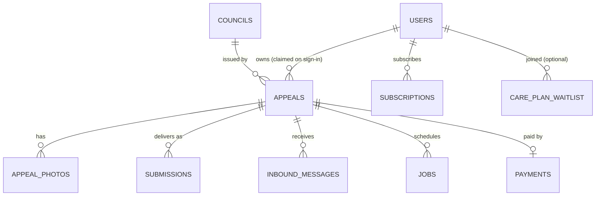

# Data model

Postgres 16 in dev (Docker Compose) → Neon Postgres in production. Drizzle ORM. Migrations under `apps/web/drizzle/`. As of 2026-05-20 the live schema has **11 tables**.

## Entities



## Tables

| Table | Purpose | Row identifier |
|---|---|---|
| **`users`** | Email/password accounts. Holds `role` (user/admin), `service_tier`, `notification_prefs` jsonb. | `id` text (ulid-style `u_<hex>`) |
| **`councils`** | KB row per London authority — portal URL, email, postal address, automation status, identifier hints, PCN ref pattern. Seeded from `lib/mock-data.ts`. Editable via `/admin/councils`. | `slug` text (e.g. `westminster`) |
| **`council_automation`** | Per-council Claude+Playwright MCP recipe — `agent_prompt`, `field_hints` jsonb, `last_dry_run`, `last_dry_run_at`, `last_dry_run_ok`. Edited via `/admin/councils/[slug]/automation`; read by `runPortalAutomation()` on every submission. | `council_slug` (PK; soft FK) |
| **`appeals`** | The case. Holds `session_id` (always) + `user_id` (null until claim), `ticket` jsonb (the extracted PCN fields), `grounds[]`, `notes`, letter fields, timeline jsonb, `service_tier`, `model_used`, `cost_pence_millis`. | `id` text (`ap_<hex>`) |
| **`appeal_photos`** | PCN + evidence photos. `kind: 'pcn' \| 'evidence'`, `blob_url`. | `id` text |
| **`payments`** | One row per Stripe PaymentIntent. | `stripe_payment_intent_id` PK |
| **`submissions`** | One row per submission attempt. `method`, `channel`, `status`, `council_reference`, `message_id`, `screenshot_url`, `last_error`, `retries`. | `id` text (`sub_<hex>`) |
| **`inbound_messages`** | Council replies received via `/api/inbound`. `classification` (cancelled / rejected / acknowledged / request / unknown). | `id` text (`in_<hex>`) |
| **`jobs`** | Postgres-backed work queue. `kind`, `payload` jsonb, `status`, `attempts`, `max_attempts`, `run_after`, `locked_at`, `locked_by`. See [job-queue.md](./job-queue.md). | `id` text |
| **`subscriptions`** | Care Plan (£9.99/mo) records — mirrors Stripe `Subscription` state. | `id` text |
| **`care_plan_waitlist`** | Pre-launch waitlist signups. Idempotent on email. | `id` text |

## DDL (live as of migration 0005)

The full schema lives in [`apps/web/lib/server/db/schema.ts`](https://github.com) and the applied migrations in `apps/web/drizzle/`:

| Migration | What it added |
|---|---|
| `0000_faithful_slapstick.sql` | Initial: councils, appeals, appeal_photos, payments, submissions + enums (`appeal_status`, `submission_method`, `payment_method`, `automation_status`) |
| `0001_spotty_invisible_woman.sql` | Nullable `ticket`, `user_id`, `reply_email` on appeals; default empty `timeline`; new `inbound_messages` table |
| `0002_whole_junta.sql` | `users` table (email, pbkdf2 hash, role, display_name, last_sign_in_at) |
| `0003_motionless_thor_girl.sql` | `jobs` table — queue + indexes on (status, run_after) and (appeal_id) |
| `0004_illegal_exiles.sql` | `appeals.service_tier`, `users.service_tier`, `users.notification_prefs`, `care_plan_waitlist` |
| `0005_mysterious_peter_parker.sql` | `subscriptions` table |
| `0006_glossy_morgan_stark.sql` | `council_automation` table — per-council MCP recipes |

## Field-by-field gotchas

- **`appeals.ticket` is nullable.** A draft appeal exists before extraction; we don't backfill placeholder ticket data.
- **`appeals.council_slug` is nullable and FK-checked.** If Claude returns a slug we don't recognise, we set this to NULL and keep the raw value on the `ticket` jsonb for diagnostics — see `attachDraftToAppeal()` in `lib/server/appeals.ts`.
- **`users.password_hash` is nullable.** OAuth-only users (Apple / Google when wired) will have a null hash; auth is via the OAuth callback, not password verification.
- **`jobs.locked_at` is the stale-lock recovery hook.** A row that's `running` with `locked_at < now() - 5 minutes` is re-claimable — covers the worker-crashed-mid-job case.
- **`care_plan_waitlist` unique on `email`.** Upsert on conflict — duplicate signups are no-ops.

## Joins worth knowing

- `inbound_messages.to_addr` encodes the appeal id (`<ap_xxx>@appeals.snappeal.ai`). `processInboundMessage()` parses the local part and joins to `appeals.id`.
- `appeals → councils` is the only nullable FK — guards against AI-invented slugs.
- `jobs.appeal_id` is a soft pointer (no FK) so jobs survive appeal deletion. Cleanup is via a periodic sweep, not cascade.

## Seed data

`apps/web/scripts/seed-councils.ts` inserts the 7 v0.1 councils:
Westminster, Kensington & Chelsea, Camden, Lambeth, Islington, TfL, City of London. Idempotent on `slug` via `onConflictDoUpdate`.

Run with: `npm run db:seed`.

## Migration workflow

```bash
# Edit lib/server/db/schema.ts
npm run db:generate    # → new SQL file in drizzle/
# Inspect the generated SQL
npm run db:migrate     # → applies pending migrations
```

Snapshot files (`drizzle/meta/_journal.json`) are checked in; rollback is a `git revert` + a fresh migration.

## What's intentionally NOT in the schema

- **Photo binary content.** Photos live in Vercel Blob (URL-only in DB). Local dev currently stores them as sessionStorage data URLs (ephemeral).
- **Audit log.** Admin actions aren't logged yet — open work for v0.2 admin UI mutations.
- **Push subscriptions** as a dedicated table. Currently stored inline on `users.notification_prefs.push` jsonb; will become a real table once we have multiple devices per user.
- **Wiki page editor state.** The wiki edits-from-admin feature was deferred — markdown is committed via git, not the DB.
