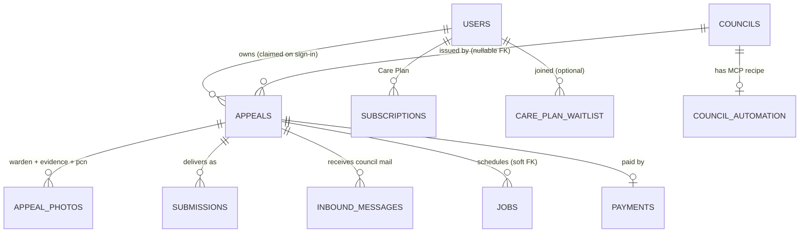

# Data model

Postgres in dev (Docker Compose) → Neon Postgres in production (via Vercel Marketplace). Drizzle ORM, schema in [`apps/web/lib/server/db/schema.ts`](../../apps/web/lib/server/db/schema.ts), migrations under `apps/web/drizzle/`.

As of v0.3.1 (2026-05-23) the live schema has **11 tables** with **14 migration files** on disk (`0000`–`0013`). `drizzle/meta/_journal.json` registers `0000`–`0011`; `0012_processing_status.sql` and `0013_appeal_strength_and_kb.sql` were hand-authored and applied directly. All later migrations use `ADD COLUMN IF NOT EXISTS` so they're idempotent — a fresh `npm run db:migrate` from `0000` to `0013` succeeds end-to-end. No schema change between v0.3.0 and v0.3.1.

## Entities



## Tables

| Table | Purpose | Row identifier |
|---|---|---|
| **`users`** | Email/password (pbkdf2-sha256, `<saltHex>:<hashHex>`) + OAuth-provider accounts. Holds `role` (`user` \| `admin`), `service_tier` (`buy_time` \| `grounds` \| `care_plan`), `notification_prefs` jsonb, plus the UK postal address fields read by the portal-automation agent (`address_line1`, `address_line2`, `address_city`, `address_postcode`, `phone`). | `id` text (ulid-style `u_<hex>`) |
| **`councils`** | KB row per London authority — portal URL, appeal email, postal address, submission methods, automation status, identifier hints, PCN ref pattern, Wikipedia-hosted `logo_url` + `logo_bg`. Editable via `/admin/councils/[slug]`. | `slug` text (e.g. `westminster`) |
| **`council_automation`** | Per-council Claude+Playwright MCP recipe — `agent_prompt` (submission), `lookup_agent_prompt` (read-only PCN lookup; nullable, falls back to `FALLBACK_LOOKUP_PROMPT` in code), `field_hints` jsonb, `last_dry_run`, `last_dry_run_at`, `last_dry_run_ok`. Edited via `/admin/councils/[slug]/automation` (with in-page dry-run + canonical-Westminster reset). | `council_slug` text (soft FK to `councils.slug`) |
| **`appeals`** | The case. Holds `session_id` (always set) + `user_id` (null until sign-in claim), `ticket` jsonb (extracted PCN fields — patched with portal-confirmed values once `pcn_lookup` succeeds), `grounds[]` (canonical ground IDs from `lib/grounds-catalog.ts`), `notes`, `portal_lookup` jsonb (validity verdict + warden-photo URLs + portal metadata), letter fields, `processing` jsonb (per-step status for the inline status rows on the smart card), `pcn_image_url` text (Blob URL), `strength_score` integer (0–100), `strength_rationale` text, `strength_improvements` jsonb (up to 3 evidence asks), `knowledge_pack_used` jsonb (audit trail of which KB entries the drafter saw), `timeline` jsonb, `council_slug` (nullable FK to `councils`), `service_tier`, `preferred_method` (`email` \| `portal` \| NULL), `model_used`, `cost_pence_millis`. | `id` text (`ap_<hex>`) |
| **`appeal_photos`** | PCN + evidence + portal-side warden photos. `kind: 'pcn' \| 'evidence' \| 'portal'`, `blob_url`. Only `portal` rows are populated today (warden photos pulled by `pcn_lookup`); user-evidence photos still ride sessionStorage data URLs until the upload helper is generalised. | `id` text |
| **`payments`** | One row per Stripe PaymentIntent. `amount_pence`, `currency`, `status` (mirrors Stripe), `method` (`apple_pay` \| `google_pay` \| `card`), `receipt_email`, `paid_at`, `refunded_at`, `refund_reason`. | `stripe_payment_intent_id` PK |
| **`submissions`** | One row per submission attempt. `method` (`portal` \| `email` \| `manual`), `channel`, `status` (`queued` \| `submitting` \| `submitted` \| `failed`), `council_reference`, `message_id` (email Message-ID), `screenshot_url`, `last_error`, `retries`. | `id` text (`sub_<hex>`) |
| **`inbound_messages`** | Council replies received via `/api/inbound` (Brevo/SendGrid webhook). `classification` is the AI verdict (`cancelled` \| `rejected` \| `acknowledged` \| `request` \| `unknown`). | `id` text (`in_<hex>`) |
| **`jobs`** | Postgres-backed work queue. `kind` (`submit_appeal` \| `pcn_lookup` \| `generate_draft`), `payload` jsonb, `status` (`queued` \| `running` \| `done` \| `failed`), `attempts`, `max_attempts` (default 3), `run_after`, `locked_at`, `locked_by`, `progress` jsonb (append-only `JobProgressEvent[]` for live SSE). See [job-queue.md](job-queue.md). | `id` text |
| **`subscriptions`** | Care Plan (£9.99/mo) — mirrors Stripe `Subscription` state. | `id` text |
| **`care_plan_waitlist`** | Pre-launch waitlist signups. Unique on `email`; upsert on conflict. | `id` text |

## Enums (Postgres-native)

- **`appeal_status`** — `draft` · `ready` · `submitting` · `submitted` · `under_review` · `decision_pending` · `cancelled` · `rejected`
- **`submission_method`** — `portal` · `email` · `manual`
- **`payment_method`** — `apple_pay` · `google_pay` · `card`
- **`automation_status`** — `manual` · `automated_beta` · `automated_ga`

## Migrations

| File | What it added |
|---|---|
| `0000_faithful_slapstick.sql` | Initial schema — `councils`, `appeals`, `appeal_photos`, `payments`, `submissions` + the four enums above |
| `0001_spotty_invisible_woman.sql` | Nullable `ticket`, `user_id`, `reply_email` on `appeals`; default empty `timeline`; new `inbound_messages` table |
| `0002_whole_junta.sql` | `users` table (email, pbkdf2 hash, role, display_name, last_sign_in_at) |
| `0003_motionless_thor_girl.sql` | `jobs` table — queue + indexes on `(status, run_after)` and `(appeal_id)` |
| `0004_illegal_exiles.sql` | `appeals.service_tier`, `users.service_tier`, `users.notification_prefs`, `care_plan_waitlist` |
| `0005_mysterious_peter_parker.sql` | `subscriptions` table |
| `0006_glossy_morgan_stark.sql` | `council_automation` table — per-council MCP recipes |
| `0007_live_submission_progress.sql` | `jobs.progress jsonb NOT NULL DEFAULT '[]'` — append-only event log for live SSE streaming |
| `0008_user_postal_address.sql` | `users.address_line1`, `address_line2`, `address_city`, `address_postcode`, `phone` — read by `loadCustomerProfile()` and injected into the portal-automation agent prompt; captured at sign-up + editable from `/app/profile/personal-details` |
| `0009_short_quicksilver.sql` | `councils.logo_url`, `councils.logo_bg` — Wikipedia-hosted emblem + background colour used by `<CouncilBadge>`. Also re-emits the column adds from 0007/0008 (idempotent via `ADD COLUMN IF NOT EXISTS`) so a fresh end-to-end migration succeeds. |
| `0010_portal_lookup.sql` | **`appeals.portal_lookup jsonb`** (validity verdict + warden-photo URLs + portal metadata — populated by the `pcn_lookup` job) and **`council_automation.lookup_agent_prompt text`** (per-council read-only-lookup prompt; nullable, falls back to `FALLBACK_LOOKUP_PROMPT` in code). Hand-written; idempotent. |
| `0011_appeal_preferred_method.sql` | **`appeals.preferred_method text`** — customer-picked submission path (`email` / `portal` / `NULL`). Stamped from the smart card's recommendation surface; gates the £2.99 PaymentSheet vs free email path inside `/api/submit`. |
| `0012_processing_status.sql` | **`appeals.processing jsonb`** (per-step status — `ocr` + `analysis` — driving the progressive checklist on the smart card) and **`appeals.pcn_image_url text`** (uploaded PCN photo — Blob URL in prod, data URL in dev — so the card shows the image across refreshes/devices). Hand-applied; not yet in `_journal.json`. |
| `0013_appeal_strength_and_kb.sql` | **v0.3.0** — `appeals.strength_score integer` (0–100, NULL until drafter runs), `appeals.strength_rationale text` (one-sentence reason shown when < 50), `appeals.strength_improvements jsonb` (up to 3 actionable evidence asks), `appeals.knowledge_pack_used jsonb` (audit trail `{usedIds, tokens}` of the markdown KB entries the drafter saw). All four columns are nullable; old rows render with no badge. Hand-applied; not yet in `_journal.json`. |

## Key embedded types

The four most consequential jsonb shapes — defined in `lib/server/db/schema.ts` and exported for reuse.

```ts
type JobProgressEvent =
  | { ts: string; kind: "status"; message: string }
  | { ts: string; kind: "step"; message: string }
  | { ts: string; kind: "thought"; message: string }
  | { ts: string; kind: "screenshot"; step: number; url: string; caption?: string }
  | { ts: string; kind: "metadata"; field: string; value: string };

type ProcessingStepStatus = "pending" | "running" | "done" | "failed";
interface ProcessingStatus {
  ocr?:      { status: ProcessingStepStatus; error?: string; completedAt?: string };
  analysis?: { status: ProcessingStepStatus; error?: string; completedAt?: string };
}

type PortalLookupVerdict = "open" | "paid" | "closed" | "not_found" | "expired" | "unknown";
interface PortalLookupSnapshot {
  jobId: string | null;
  status: "pending" | "verified" | "invalid" | "skipped" | "overridden" | "error";
  verdict?: PortalLookupVerdict;
  verdictReason?: string;
  photoUrls: string[];
  metadata?: {
    pcnRef?: string;
    vehicleReg?: string;
    contraventionCode?: string;
    location?: string;
    issuedAt?: string;
    amountPence?: number;
    discountUntil?: string;
    fullChargeFrom?: string;
    dueDateAt?: string;
    paidAt?: string;
  };
  fetchedAt: string;
}

interface KnowledgePackAudit {
  usedIds: string[];
  tokens: number;
}
```

## Field-by-field gotchas

- **`appeals.ticket` is nullable.** A draft appeal exists before extraction; we don't backfill placeholder ticket data.
- **`appeals.council_slug` is nullable and FK-checked.** If Claude returns a slug we don't recognise, we set this to NULL and keep the raw value on the `ticket` jsonb for diagnostics — see `attachDraftToAppeal()` in `lib/server/appeals.ts`.
- **`appeals.preferred_method` is nullable until the user picks.** NULL means the recommendation card is still being presented; setting it to `portal` triggers the £2.99 PaymentSheet, setting it to `email` (when the council has an `appealEmail`) takes the free fallback path.
- **`appeals.strength_score` is nullable.** Old rows (pre-v0.3.0) and any appeal that hasn't been drafted yet have no strength badge.
- **`appeals.processing.{ocr,analysis}.status`** is merged atomically by `setProcessingStep()` in `lib/server/appeals.ts` so two parallel steps can't clobber each other. Portal-lookup status lives on `portal_lookup.status` (separate so each step's error trail stays targeted).
- **`users.password_hash` is nullable.** OAuth-only users have no hash; auth runs through the OAuth callback in `/api/auth/oauth/[provider]`, not password verification.
- **`jobs.locked_at` is the stale-lock recovery hook.** A row that's `running` with `locked_at < now() - 5 minutes` is re-claimable — covers the worker-crashed-mid-job case.
- **`care_plan_waitlist.email` is unique.** Upsert on conflict — duplicate signups are no-ops.

## Joins worth knowing

- **`inbound_messages.to_addr`** encodes the appeal id (`<ap_xxx>@appeals.parkingrabbit.com`). `processInboundMessage()` parses the local part and joins to `appeals.id`.
- **`appeals.council_slug → councils.slug`** is the only nullable FK — guards against AI-invented slugs.
- **`jobs.appeal_id`** is a soft pointer (no FK) so jobs survive appeal deletion. Cleanup is via periodic sweep, not cascade.

## Seed data

`apps/web/scripts/seed-councils.ts` inserts the **7 v0.1 councils** sourced from `apps/web/lib/mock-data.ts`: Westminster, Kensington & Chelsea, Camden, Lambeth, Islington, TfL, City of London. Idempotent on `slug` via `onConflictDoUpdate`. Run with `npm run db:seed`. Logos are populated separately by `scripts/populate-council-logos.ts`.

## Migration workflow

```bash
# Edit lib/server/db/schema.ts
npm run db:generate    # → new SQL file in drizzle/
# Inspect the generated SQL
npm run db:migrate     # → applies pending migrations
```

Snapshot files (`drizzle/meta/_journal.json`) are checked in; rollback is a `git revert` + a fresh migration. Hand-authored migrations (0007, 0008, 0010, 0011, 0012, 0013) bypass `db:generate` but live in the same folder and apply through the same `db:migrate` command — they use `ADD COLUMN IF NOT EXISTS` to stay idempotent.

## What's intentionally NOT in the schema

- **Photo binary content.** Photos live in Vercel Blob (URL-only in DB). Local dev currently stores user-evidence photos as sessionStorage data URLs (ephemeral) until the upload pipeline is generalised.
- **Audit log of admin mutations.** Not yet wired — open work.
- **Push subscriptions as a dedicated table.** Currently inline on `users.notification_prefs.push` jsonb; will become a real table once we have multiple devices per user.
- **Wiki page editor state.** Markdown is committed via git, not the DB; `/admin/wiki` is a read-only iframe embed of the mkdocs site at `localhost:8800`.
