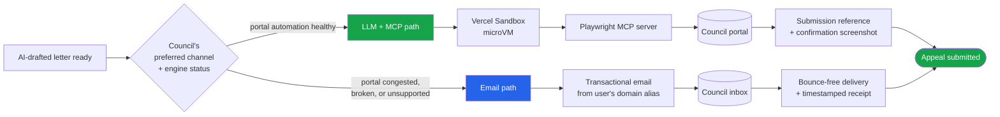

# Submission engine

What the user is paying £2.99 for, technically. The submission engine is the bridge between the AI-drafted letter and the council's "we received your appeal" confirmation.

**Status as of v0.3.1 (2026-05-23)** — the engine is implemented and wired end-to-end. The portal path uses the headless `claude` CLI with Playwright MCP attached and **defaults to LIVE**; the engine reads `SNAPPEAL_SUBMISSION_LIVE !== "0"`, so missing/empty/anything-but-`"0"` runs the real Playwright flow. Set `SNAPPEAL_SUBMISSION_LIVE=0` to opt into the deterministic mock. The email path is Resend-compatible (Resend by default, stubbed in dev). Both are dispatched via the [job queue](./job-queue.md) so `/api/submit` returns in &lt;100 ms while the actual work runs on a worker.

**v0.3.1 prewarm.** `lib/server/submission/mcp-warm.ts → prewarmMcp()` is called by `lib/server/jobs/worker.ts → startWorker()` on boot. It spawns `@playwright/mcp` + Chromium once so customer #1 of a fresh deploy gets the same latency as customer #100 — no 30–60 s cold-start tax on the first portal-automation or pcn-lookup job.

**Three Playwright MCP paths.** `runPortalLookup()` (read-only PCN verdict + warden photos, fired *before* the user pays), `runPortalAutomation()` (the £2.99 submit), and the admin dry-run path (same submit flow but stopped at review). All three share the `runAgentic()` wrapper, the workDir + screenshot watcher, the SSE progress pipeline, and the per-council prompt + field hints from `council_automation`.

**Fallback fires on BOTH a thrown agent error AND a returned `success: false`** — early versions only fell back on throws, which let "service unavailable" responses end as silent failures instead of routing to email.

## The two paths



Both paths produce the same observable outcome from the user's perspective: an appeal has been delivered to the council with a recorded timestamp. The user pays for **delivery**, not for which path delivered.

## Path 0 — Portal lookup (read-only, pre-submission validation)

Implemented in `lib/server/submission/lookup.ts → runPortalLookup()`. Runs **before** the user pays — fired from the smart card on `/app/tickets` once the customer confirms the PCN by tapping "I agree to T&Cs". The agent walks the council portal with the PCN reference + vehicle reg, opens the "View images" / ticket-details route (never the challenge route — `prompts/westminster_lookup.ts` explicitly inverts the submission prompt's "View images is a decoy" rule), captures the warden photos, and reads visible metadata.

Key differences from Path 1:

- **Read-only.** The system prompt forbids clicking Submit / Pay / Make representation. Hard rule, repeated at the top + bottom of the prompt.
- **Different schema.** `LookupResultSchema` returns `{ success, verdict, verdictReason, metadata: {...}, photoFiles[], stepsCompleted, errorMessage }` — much wider than the submission `{ success, councilReference, notes?, errorMessage? }`.
- **Tighter wall-clock.** 3-minute cap vs submission's 5-minute, because there's no letter to paste + no review-page wait.
- **Photo persistence.** Warden screenshots go through `uploadPortalPhotos()` (`lib/server/blob.ts`) → Vercel Blob (or `public/dev-blobs/` fallback) → `appeal_photos` rows with `kind='portal'`. First real writer for that table.
- **Result persistence.** `persistPortalLookup()` (in `lib/server/appeals.ts`) writes the snapshot to `appeals.portal_lookup` jsonb AND merges any portal-confirmed fields into `appeals.ticket` so the downstream letter draft uses the council's record instead of OCR.
- **Verdict-driven routing.** The smart `<TicketCard>` subscribes to the lookup job's SSE via `useAppealLiveState`. When the job settles, the card's status pill morphs inline to reflect the verdict — no modal, no route change. Invalid verdicts (`paid` / `closed` / `not_found`) flip the card to `deriveCardState`'s `terminal` state with an inline "I disagree — let me appeal anyway" override button that POSTs `/api/appeals/[id]/lookup/override`. Valid verdicts flip the card to `needs_decision` (recommendation card with Appeal / Pay yourself / Rabbit Pay Coming Soon). **Server-side gate**: `/api/submit` returns `409 PCN_NOT_APPEALABLE` if `appeal.portalLookup.verdict ∈ {paid, closed, not_found}` and `status ≠ overridden` — defence in depth against direct API calls.

Shared with Path 1:
- Same `runAgentic()` (`lib/server/claude-cli.ts`), same Playwright MCP `--output-dir` workDir, same screenshot watcher (`watchScreenshots()`), and the v0.3.1 `prewarmMcp()` at worker boot benefits both paths equally.
- Same SSE progress pipeline (`lib/server/submission/_progress.ts → emitToolStep`, `extractJsonObject`) including the v0.3.1 4 KB padding + identity encoding + 150 ms poll + 3 s keep-alive on `/api/jobs/[id]/progress`.
- Same per-council seeding pattern: `getAutomation()` reads `council_automation.lookup_agent_prompt` (nullable; falls back to a generic `FALLBACK_LOOKUP_PROMPT` in code). Edit + dry-run from `/admin/councils/<slug>/automation`.

For non-automated councils (`automation_status` ≠ `automated_beta` / `automated_ga`), the API stamps a `status: 'skipped'` snapshot inline and returns `{ skipped: true }` so the smart card surfaces the recommendation immediately — flipping a council on later is a one-row DB change.

## Path 1 — LLM + Playwright MCP (primary)

Implemented in `lib/server/submission/portal.ts`. When the council's online portal is supported and healthy:

0. **Client-side payment gate.** The `letter_ready` state on the smart `<TicketCard>` (on `/app/tickets`) opens `PaymentSheet` (`components/PaymentSheet.tsx`) when the customer taps Pay, mounting either the Stripe `<PaymentElement>` (Apple Pay / Google Pay / card auto-detected) or `FakePaymentButtons` when `NEXT_PUBLIC_SNAPPEAL_FAKE_PAYMENT=1`. Only on a succeeded PaymentIntent does the card POST to `/api/submit` with that intent id. The route itself verifies the id against Stripe (unless `SNAPPEAL_SKIP_PAYMENT_CHECK=1`) before enqueueing the job — so the engine is doubly gated. (`/app/tickets/[id]` and `/app/letter/<id>` are server-side redirects to `/app/tickets?expand=<id>`; everything renders on the list page.)
1. `/api/submit` enqueues a `submit_appeal` job in the [Postgres queue](./job-queue.md) — durable, retry-safe.
2. A worker (booted by `instrumentation.ts`) claims the job with `FOR UPDATE SKIP LOCKED`.
3. The worker calls `runPortalAutomation()`. It **loads the per-council agent prompt** from the `council_automation` table (the same prompt the admin edits at `/admin/councils/[slug]/automation`) and falls back to a generic prompt if no row exists for this slug.
4. The worker spawns the headless `claude` CLI with `@playwright/mcp@latest` attached via `--mcp-config` and `--allowedTools 'mcp__playwright__* Read Write'`. The per-council prompt is injected as the system prompt.
5. The agent opens the portal URL, fills the form from the appeal payload (PCN reference, vehicle reg, contravention code, location, issued-at, reply-to email), pastes the drafted letter into the representation field verbatim, submits, captures the confirmation reference + screenshot, returns a single `{success, councilReference, errorMessage}` JSON.
6. The screenshot is saved to a temp dir; the JSON is parsed; the result is recorded in the `submissions` table and the appeal status flips.

**Editing the prompt mid-flight.** Because the worker reads from `council_automation` on every job claim, an admin who saves an updated prompt in `/admin/councils/<slug>/automation` sees that prompt take effect on the very next claimed job. No restart needed.

A **5-minute wall-clock cap** and an **agent-side "stop after 30 steps" instruction** prevent runaway loops. Captcha / login-wall / payment-page signals trigger an abort with success=false — never a silent submit.

**Why an LLM agent rather than scripted Playwright?** Three reasons:

- **Form variability.** Council forms differ subtly even when using the same vendor (Taranto, Civica, etc.). An LLM agent reading the form's actual current state is more robust than hand-tuned selectors that break on every CMS update.
- **Field-mapping intelligence.** When a council form asks "What is the basis for your representation?" with a free-text box, the agent maps from our stage-aware ground (e.g. statutory ground "Procedural impropriety") to the council's expected register.
- **Schema is the floor, not the ceiling.** The KB schema gives the agent a starting hint (URL, expected fields). The agent handles surprises — popups, captcha challenges (where legally permitted to interpret, not bypass), session timeouts, multi-step wizards.

This is what "we will MCP appeal the ticket using a LLM" cashes out to.

## Path 2 — Email submission (fallback)

When the portal path can't be used. Reasons:

- **Portal congestion** — council's portal is throttling, slow, or returning errors. A retry budget is consumed without success.
- **Portal not supported yet** — the council's form schema isn't in the KB for the relevant contravention stage.
- **Portal explicitly unsupported by the council** — some councils accept appeals **only** by email or post for certain stages.
- **Engine outage** — the LLM agent, the Sandbox, or Playwright MCP is unavailable; we route around the failure rather than block the user.

When fallback fires:

1. The workflow composes a structured email — the appeal letter as body, photos as attachments, PCN reference + vehicle reg in the subject line per the council's stated format.
2. Email is sent from a per-user transactional alias (`<user-id>@appeals.parkingrabbit.com`) so the council's reply lands in our inbound mail handler — closing the loop on response tracking (see [response-tracking](#response-tracking-stub)).
3. The submission is recorded with `method: "email"` and the email's message-id as the immutable receipt.
4. We monitor for bounces; a bounce promotes to a manual ops queue rather than silently failing.

**Email is not second-class.** For councils that prefer email (or whose portal is unreliable), email is the *first*-class channel. The fallback framing is about routing — not about quality.

## Decision logic — which path?

`lib/server/submission/index.ts → runSubmission()` makes the call at the moment the worker picks up the job:

```ts
if (council.automationStatus === "automated_beta" || "automated_ga") {
  try {
    return await runPortalAutomation({ appeal, council });
  } catch (err) {
    // Portal failed mid-run. If the council has an email on file, try that.
    if (council.appealEmail) {
      const fallback = await sendCouncilEmail({ appeal, council });
      return { ...fallback, lastError: `portal failed: ${err.message}` };
    }
    return { method: "portal", status: "failed", lastError: err.message };
  }
}
if (council.appealEmail) return await sendCouncilEmail({ appeal, council });
return mockSubmission(appeal, "no portal automation and no email on file");
```

When `SNAPPEAL_SUBMISSION_LIVE` is unset (the default for dev + CI), `runSubmission()` short-circuits to a deterministic `mockSubmission()` that records a fake `MOCK-XXXXXX` reference — so the full flow can be exercised without real network side effects.

A small number of councils support only postal submission for certain stages — these are deferred to a manual-handoff queue and the user is told before payment.

## What we promise the user (and don't)

Pre-payment screen states:

> **£2.99 — one-off, non-refundable.** We'll draft your appeal and submit it to your council — through their online portal where possible, or by email when the portal is unavailable. You're paying for the work we deliver, not for the outcome.

We do **not** promise:

- A specific submission channel. The engine picks the best available route.
- Sub-minute submission time. Portal automation typically completes in 30–90 seconds; email submission is near-instant; but a congested portal might queue our job for several minutes. Either way the user sees "Submitted ✓" once delivery is confirmed.
- A specific council response time. The submission timestamp is ours; everything after is the council's.

## Per-council rollout order

Portal automation ships in waves:

1. **Westminster** (highest London volume)
2. **Kensington & Chelsea** (Chatbot Max — needs conversation handler)
3. **Camden**
4. **Lambeth** (separate informal / formal forms — stage-aware)
5. **Islington**
6. **TfL** (red routes, bus lanes)
7. **City of London** (Taranto platform — selectors reusable for other Taranto councils)
8. **Newham**, **Hammersmith & Fulham**, **Lewisham** (top per-borough volumes)
9. Then breadth across remaining London boroughs

For every borough not yet automated, **the email fallback path is active from day one** — so there is no "unsupported council" experience in v0.1, just "submitted via portal" or "submitted via email".

## Failure handling

| Failure | Engine behaviour | User-visible state |
|---|---|---|
| Form schema not found / outdated selector | LLM agent attempts recovery; on third failure, escalate | Path switches to email fallback; user sees "Submitted ✓" |
| Captcha or human-only barrier | Stop automation, switch to email | User sees "Submitted via email ✓" |
| Email bounces | Move to ops queue, alert admin | User sees "Awaiting confirmation — we'll update you" |
| Council closed for submissions (e.g. system down) | Retry with backoff for up to 6 hours; then ops escalation | User sees "Queued — council system down, retrying" |
| Workflow itself crashes | Vercel Workflow retries idempotently | User sees no change; we observe internally |

## Response tracking — implemented

Council replies arrive at the per-appeal alias (`<appeal-id>@appeals.parkingrabbit.com`, stored on `appeals.reply_email`). `/api/inbound` is the webhook target:

1. Accepts a Postmark / Resend / SES envelope (from / to / subject / text / html / headers).
2. `lib/server/inbound.ts → processInboundMessage()` runs a small Claude CLI call with a tiny schema to classify into `cancelled | rejected | acknowledged | request | unknown`.
3. The full message + classification lands in the `inbound_messages` table.
4. When the classification is `cancelled` or `rejected`, the appeal's `status` is updated; on the Tickets list the card collapses to its resolved variant ("Cancelled £X" green, or "Closed £X" slate), and the Inbox thread shows the new message.

Production needs DNS + MX wiring for `appeals.parkingrabbit.com` plus a transactional provider that forwards to the webhook — pending pick (Postmark Inbound is the front-runner).

## Sources and references

- [Knowledge base schema](knowledge-base.md) — the per-council records this engine consumes.
- [System overview](system-overview.md) — where this engine sits in the wider system.
- [AI pipeline](ai-pipeline.md) — the model used by the LLM agent inside the Sandbox.
- [Pricing](../business/pricing.md) — the commercial frame around what we promise.
