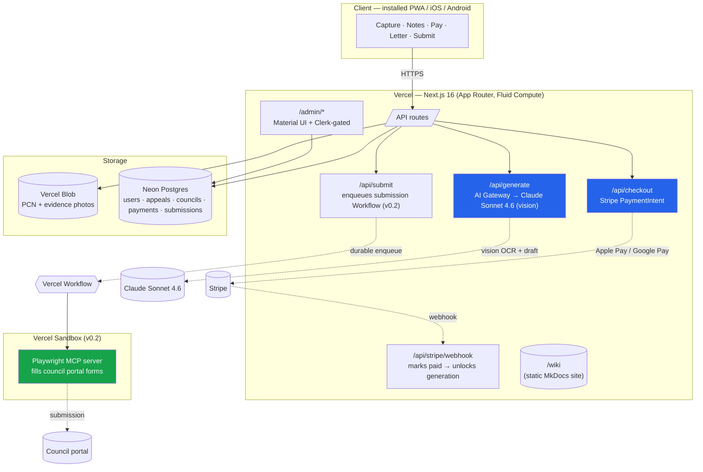

# System overview

## High-level diagram

## Components in narrative

**Client (PWA → Capacitor wrapper in v0.3).** Next.js 16 App Router, mobile-first. Lives behind the same domain as the wiki and admin (served by Vercel; no separate hosting for the customer app). State persists locally (IndexedDB) for anonymous users; syncs to Postgres once the user signs in (v0.2 onward, Clerk).

**Next.js API routes (Fluid Compute).** Default runtime is Fluid Compute Node.js. The four hot paths:

- `/api/generate` — single AI call. Receives PCN photo + evidence photos + notes + KB context. Returns structured JSON with extracted ticket fields + identified council slug + drafted letter. Streams letter tokens to the client.
- `/api/checkout` — creates a Stripe PaymentIntent for 299p GBP. Returns client secret + Payment Element config.
- `/api/stripe/webhook` — verifies Stripe signature, marks the appeal `paid`, unlocks letter generation.
- `/api/submit` — v0.1 stub (records submission intent + returns council portal URL). v0.2 enqueues a Vercel Workflow.

**Database (Neon Postgres via Vercel Marketplace).** Tables: `users`, `sessions`, `appeals`, `appeal_photos`, `councils`, `contraventions`, `payments`, `submissions`, `wiki_pages`. Drizzle ORM. EU region for UK data residency.

**Object storage (Vercel Blob).** Private buckets. Photos uploaded directly from client via signed URLs. 90-day TTL after appeal resolved (Phase B onward).

**Admin (Phase B).** Next.js 16 + Material UI. Clerk-gated by `admin` org role. CRUD for councils, contraventions, wiki content. Appeals dashboard.

**Wiki (Phase A — what you're reading).** MkDocs Material, static build, served via Vercel's static site hosting (or Caddy in the local dev compose).

**AI pipeline.** Vercel AI Gateway routes to Claude Sonnet 4.6 by default; failover to Claude Haiku 4.5 for cost-sensitive extraction. See [ai-pipeline.md](ai-pipeline.md).

**Submission engine.** A durable Vercel Workflow runs two paths: **portal automation** (Vercel Sandbox + Playwright MCP + LLM agent fills the council's online form) and **email fallback** (transactional email from a per-user alias when the portal is congested, unsupported, or down). Both paths are first-class — the engine picks the best available route at submission time. See [submission-engine.md](submission-engine.md).

**Knowledge base.** The council records that everything keys off. Schema in [knowledge-base.md](knowledge-base.md). Editable by admins in Phase B.

## Latency budget (v0.1 happy path)

| Stage | Target |
|---|---|
| Photo upload (client → Blob) per image | < 800 ms |
| PaymentIntent create | < 400 ms |
| Apple Pay confirm round-trip | 1–3 s (user-controlled) |
| AI call: first letter token | < 2 s |
| AI call: complete letter | < 12 s |
| End-to-end: photos done → letter complete | **< 20 s** |

If we cannot hit "first letter token < 2 s" the streaming UX collapses to a spinner; that is a release-blocker.

## Failure modes (v0.1)

- **AI extraction fails** → user falls back to manual entry on the details form.
- **AI generation fails** → retry once automatically; on second failure, the appeal is held in `failed-to-generate` state and the user is offered a service-failure refund (the rare case where we refund — distinct from outcome refunds, which we never offer).
- **Payment fails** → return user to notes step, photos + notes still in IndexedDB.
- **Stripe webhook arrives late** → generation polls payment status for up to 30 s, then surfaces "still waiting on payment" with a refresh button.

## Why these choices

| Decision | Why |
|---|---|
| Next.js 16 App Router | Same stack as the eventual admin; Vercel's first-class framework; supports streaming. |
| Vercel Fluid Compute (not Edge) | Full Node.js compatibility for AI SDK v6 + Stripe SDK + Playwright; Edge limitations are no longer a price worth paying. |
| Vercel AI Gateway (not direct Anthropic) | Per-call observability, model failover, no provider lock-in. |
| Neon Postgres (not SQLite/file) | Multi-region, branchable for dev/staging, integrates with Vercel Marketplace. |
| Vercel Blob (not S3) | Auto-provisioned via Marketplace, integrated billing. |
| Playwright MCP (not custom Puppeteer) | MCP gives the AI agent a structured browser API instead of generated CSS selectors. |
| Capacitor (not Expo/React Native) | The customer app is 95% web; rewriting in RN buys little and costs months. |
