# System overview

ParkingRabbit is a single Next.js 16 App Router app (`apps/web`) — server-rendered pages + 34 API routes + an in-process worker — backed by Postgres, Vercel Blob, Stripe, and the headless `claude` CLI driving Playwright MCP for council-portal automation. Internally the codebase is named **Snappeal** (env vars use the `SNAPPEAL_*` prefix); the public product is **ParkingRabbit**.

## High-level diagram

```mermaid
flowchart TB
    subgraph Client["Client — PWA (iOS Safari · Android Chrome · desktop)"]
        Card["/app/tickets · single-surface &lt;TicketCard&gt;<br/>(processing → pending_review → validating →<br/>needs_decision → gathering_evidence → drafting →<br/>letter_ready → submitting → submitted<br/>+ 5 failure kinds)<br/>renders state via &lt;TicketLifecycleTimeline&gt;"]
        ScanPage["/app/scan · Camera / Upload / Manual trio<br/>(BottomNav FAB → here)"]
        Support["/app/support · mailto + chat scaffold"]
        Watcher["&lt;NotificationWatcher&gt; in /app layout<br/>polls /api/appeals 5s fg / 30s bg"]
        ScanOv["&lt;ScanningOverlay&gt; on the PCN image preview<br/>during OCR (no full-page chrome)"]
        SW["Service worker (sw.js)<br/>Web Push + offline shell"]
    end

    subgraph Vercel["Web tier — Next.js 16 App Router (apps/web/app/api/*)"]
        direction TB
        Auth["/api/auth/* — email+pbkdf2 / OAuth / JWT cookie / sessionId header"]
        Appeals["/api/appeals/* — CRUD, lookup, lookup/override, status"]
        Extract["/api/extract — Claude vision OCR + photoCoach"]
        Improve["/api/improve-notes — strengthen raw notes"]
        Transcribe["/api/transcribe — voice → text"]
        Generate["/api/generate + /api/generate-stream<br/>(SSE: ticket → grounds → letter → strength → done)"]
        Checkout["/api/checkout — £2.99 Stripe PaymentIntent"]
        Care["/api/subscriptions/care-plan + /api/care-plan/waitlist"]
        StripeWH["/api/stripe/webhook"]
        Submit["/api/submit — verify payment → enqueue submit_appeal job"]
        Jobs["/api/jobs/[id] + /api/jobs/[id]/progress (SSE)"]
        SubmitProg["/api/appeals/[id]/submit-progress (GET)<br/>persisted event log — survives page reload"]
        Inbound["/api/inbound — Brevo/SendGrid mail webhook"]
        Health["/api/health"]
        AdminAPI["/api/admin/* — councils, automation, jobs, settings, inbound, mcp"]
    end

    subgraph Server["Server libs (apps/web/lib/server)"]
        direction TB
        AI["ai.ts — extractTicket / coachPhoto /<br/>strengthenNotes / generateDraft"]
        Knowledge["knowledge.ts — deterministic ranker, 2500-tok cap<br/>over apps/web/knowledge/{precedents,codes,councils}"]
        AppealsSvc["appeals.ts — createAppeal, patchAppeal,<br/>attachDraftToAppeal, persistPortalLookup,<br/>recordSubmission, setProcessingStep"]
        ClaudeCLI["claude-cli.ts — runStructured / runAgentic"]
        Settings["settings.ts — runtime toggles<br/>(mcpHeaded · stopAtReview · submissionLive ·<br/>workerDisabled · fakePayment · skipPaymentCheck ·<br/>showMcpLiveView)"]
        Queue["jobs/queue.ts — FOR UPDATE SKIP LOCKED"]
        Worker["jobs/worker.ts — in-process pool<br/>(2 submit_appeal · 3 pcn_lookup)<br/>boots from instrumentation.ts<br/>recoverZombies → prewarmMcp → spawn loop"]
        SubIndex["submission/index.ts — decision tree"]
        Portal["submission/portal.ts — Claude+Playwright MCP submit"]
        Lookup["submission/lookup.ts — read-only Claude+Playwright MCP lookup"]
        EmailSub["submission/email.ts — fallback email send"]
        McpWarm["submission/mcp-warm.ts — prewarmMcp()"]
    end

    subgraph Storage["Storage"]
        DB[("Neon Postgres — 11 tables<br/>users · appeals · jobs · submissions ·<br/>inbound_messages · councils · council_automation ·<br/>appeal_photos · payments · subscriptions ·<br/>care_plan_waitlist")]
        Blob[("Vercel Blob<br/>PCN + evidence + warden photos")]
    end

    subgraph External["External services"]
        ClaudeBin[("claude CLI binary<br/>Sonnet 4.6")]
        MCP[("@playwright/mcp + Chromium")]
        StripeSVC[(Stripe)]
        Mail[(Brevo / SendGrid)]
        Council[(Council portal)]
    end

    Card --> Auth
    Card --> Appeals
    Card --> Extract
    Card --> Generate
    Card --> Submit
    Card --> Jobs
    Card --> SubmitProg
    Card -.->|"register"| SW
    Watcher --> Appeals

    Extract --> AI
    Improve --> AI
    Generate --> AI
    AI --> Knowledge
    AI --> ClaudeCLI
    ClaudeCLI --> ClaudeBin

    Appeals --> AppealsSvc
    AppealsSvc --> DB
    Submit --> Queue
    Queue --> DB
    Worker --> Queue
    Worker --> McpWarm
    McpWarm --> MCP

    Worker --> SubIndex
    SubIndex --> Settings
    SubIndex --> Portal
    SubIndex --> EmailSub
    SubIndex --> Lookup
    Portal --> ClaudeCLI
    Portal --> MCP
    MCP --> Council
    Lookup --> ClaudeCLI
    Lookup --> MCP
    Lookup --> Blob
    EmailSub --> Mail
    Mail -.->|"reply"| Inbound

    Checkout --> StripeSVC
    Care --> StripeSVC
    StripeSVC -.->|"webhook"| StripeWH

    AdminAPI --> Settings
    AdminAPI --> DB

    style Generate fill:#2563eb,color:#ffffff
    style Extract fill:#2563eb,color:#ffffff
    style Portal fill:#16a34a,color:#ffffff
    style Lookup fill:#16a34a,color:#ffffff
    style Knowledge fill:#a855f7,color:#ffffff
    style ClaudeBin fill:#0a1929,color:#ffffff
    style MCP fill:#0a1929,color:#ffffff
```

## Components in narrative

**Client.** Next.js 16 PWA, mobile-first, App Router. The customer-facing surface is a single page — `/app/tickets` — rendering one `<TicketCard>` per appeal. Every state in the lifecycle (`processing` → `pending_review` → `validating` → `needs_decision` → `gathering_evidence` → `drafting` → `letter_ready` → `submitting` → `submitted` / `cancelled` / `rejected`, plus 5 failure kinds added in v0.3.3) renders on the same card via the v0.3.3 `<TicketLifecycleTimeline>` — a single vertical journey from upload → resolution where each step hosts inline children (image preview, grounds quiz, Pay/appeal choice tiles, letter preview). The card has no full-page blockers; OCR uses the v0.3.3 `<ScanningOverlay>` mounted **inside** the image preview (a soft blue veil + sweep scan-line + corner brackets — `absolute inset-0` to the preview, not `fixed` to the viewport). `/app/tickets/[id]` is a server-side redirect to `/app/tickets?expand=<id>`; `/app/capture` is a server-side redirect to `/app/tickets?scan=1`. Photo upload happens via `lib/client/uploadPcn.ts` (camera + library inputs, 8 MB cap).

**The `/app/*` shell.** `app/app/layout.tsx` mounts `<NotificationWatcher>` once at the top, then renders the route's children, then `<BottomNav>` at the bottom. Bottom nav is **Home · Tickets (with unread-count badge) · [Scan FAB → `/app/scan`] · Support · Profile**. The Inbox tab is retired (v0.3.2); the Scan FAB is a plain `<Link href="/app/scan">` as of v0.3.3 (the v0.3.2 inline-file-picker behaviour was retired).

**`/app/scan` (v0.3.3).** Dedicated landing page reached by tapping the BottomNav Scan FAB. Animated scanner preview frame at the top (dark glass card with `snappeal-hero-scan` sweep + corner brackets + radial ambient glow + grid overlay + centre Camera icon + "Position the PCN in the frame" copy — visual only). Three explicit buttons below in priority order:
1. **Camera** (primary, blue) — `<input type="file" capture="environment">`.
2. **Upload picture** (secondary white card) — `<input type="file">` for library picks.
3. **Input manually** (secondary white card) — `<Link href="/app/manual-entry">`.
Camera + Upload both feed `uploadPcn(dataUrl)` → `router.push("/app/tickets?expand=<appealId>")`. Inline red error pill surfaces on upload failure.

**`/app/support` (v0.3.2, unchanged).** Replaces the Inbox tab. Chat-style scaffold: a "Talk to a human" card with primary `Start a conversation` button (`mailto:support@parkingrabbit.com`), plus a conversation-thread placeholder ready for a live-chat provider drop-in (Intercom / Crisp / etc.). Reads as a chat surface so the provider integration is non-structural.

Service worker (`public/sw.js`) handles Web Push + a small offline shell. Persistence: sessionStorage for in-flight photo data URLs only — everything else moves to the server (`appeals` row) on first PATCH. The in-app notification store (`lib/client/notifications.ts`) persists to `localStorage["snappeal.notifications"]` capped at 50 records.

**Web tier (Next.js API routes).** 34 endpoints across `apps/web/app/api/*`. Auth via HS256 JWT in an httpOnly cookie plus a sessionId header for guest carry-through. Every route validates input with a zod schema in `lib/server/contracts.ts`. The heavy AI routes (`/api/extract`, `/api/generate`, `/api/generate-stream`, `/api/improve-notes`, `/api/transcribe`) shell out to the `claude` CLI via `lib/server/claude-cli.ts`; the in-process semaphore caps concurrent subprocesses.

**`claude-cli.ts` — two modes.** `runStructured(prompt, schema, imageDataUrls, timeoutMs)` for one-shot JSON Schema output (used by `/api/extract`, `/api/generate`, `/api/improve-notes`, inbound classification). `runAgentic(prompt, mcpServers, timeoutMs)` for multi-turn agent work with tool use (used by submission + lookup automation against the Playwright MCP server). Both spawn the `claude` binary directly (no shell), resolving it from `PATH`.

**Knowledge base.** `apps/web/knowledge/{precedents,codes,councils}/*.md` — markdown with YAML frontmatter. `lib/server/knowledge.ts` is a lazy-singleton loader: parses all frontmatter once at module init, then for every draft call scores `+3` per ground intersection, `+2` for matching contravention code, `+1` for matching council, `+2` for cancelled outcome, `+1` for ≤ 24-month date — filters score ≥ 3, sorts score desc + date desc, takes top 6 precedents, primary + 1 similar contravention-code brief, exact-slug council brief. Caps at 2500 tokens with summary-first truncation. Audit trail (`{usedIds, tokens}`) persists to `appeals.knowledgePackUsed`. `import "server-only"` fence prevents client-bundle leakage.

**Worker tier.** In the dev process today; can run on a dedicated box in prod by setting `SNAPPEAL_DISABLE_WORKER=1` on the web tier and pointing the worker process at the same Neon DB. Boots from `instrumentation.ts`: `recoverZombies()` → `prewarmMcp()` → spawn one loop per slot. `CONCURRENCY` in `lib/server/jobs/worker.ts` allocates **2 slots for `submit_appeal`** (Playwright MCP runs are heavy) and **3 slots for `pcn_lookup`** (read-only, cheaper). Each loop polls `claimNext(workerId)` every **1.5 s** — atomic `FOR UPDATE SKIP LOCKED` against the `jobs` table — runs the handler, marks done/failed. Stale-lock recovery: a `running` job whose `locked_at < now() - 5 minutes` is re-claimable.

**Submission engine.** `lib/server/submission/index.ts` is the decision tree called by the `submit_appeal` handler. The branch order is: no council/letter → mock; `SNAPPEAL_SUBMISSION_LIVE=0` → mock; `method=email` AND council has `appealEmail` → `sendCouncilEmail()`; council `automationStatus ∈ {automated_beta, automated_ga}` → `runPortalAutomation()` with fallback to email; council has email → `sendCouncilEmail()`; otherwise → mock. Portal automation runs a headless Claude + Playwright MCP agent using the per-council `agentPrompt` + `fieldHints` from `council_automation`, with a **5-minute wall-clock cap** and a **30-step agent budget**.

**Portal lookup.** `lib/server/submission/lookup.ts` is the read-only sibling. Enqueued as a `pcn_lookup` job during evidence-gathering; the agent navigates the council portal, looks up the PCN by reference + reg, reads the verdict (`open | paid | closed | not_found | expired | unknown`), uploads warden photos to Vercel Blob, and stamps `appeals.portalLookup` (a `PortalLookupSnapshot`) with verdict + photoUrls + metadata.

**SSE delivery for live progress.** `/api/jobs/[id]/progress` and `/api/generate-stream` stream `JobProgressEvent[]` / generation frames over SSE. As of v0.3.1, every event is **padded to 4 KB** with a trailing comment payload so Cloudflare doesn't buffer small chunks; headers force `cache-control: no-store, no-transform`, `content-encoding: identity`, `x-accel-buffering: no`. Poll cadence 150 ms; keep-alive comment every 3 s. `useAppealLiveState` projects `status`-kind frames onto `latestStep` so the smart card's inline status rows tick in real time.

**Persisted submit-history replay** (v0.3.2). The SSE stream's events buffer is in-memory — a page reload mid-submission would lose it. **`GET /api/appeals/[id]/submit-progress`** returns `{ events: JobProgressEvent[], jobId, status }` for the most-recent `submit_appeal` job belonging to the appeal (ownership-gated via `canViewAppeal`). The smart card's Watch-Live gallery hits this endpoint on mount so the screenshot reel + agent thoughts survive a reload — the in-flight SSE stream remains the live path while a job is running; this endpoint is the "what happened" replay.

**Background notification system** (v0.3.2). `<NotificationWatcher>` (`components/NotificationWatcher.tsx`) polls `/api/appeals` every **5 s in foreground / 30 s when `document.visibilityState === "hidden"`** and emits notifications on three deltas per appeal: portal-lookup `status` transitioning out of `pending`, `letterBody` becoming non-null (or `step === "generation_failed"`), `appeal.status` transitioning out of `submitting`. Notifications land in the client-side store (`lib/client/notifications.ts` — three `NotificationKind`s: `validation` / `draft` / `submit`; idempotent on id; localStorage-backed, capped at 50) AND fire as native browser notifications via `new Notification("ParkingRabbit", { tag: appealId })` when permission has been granted. `<NotificationPermissionSheet>` asks for permission **context-sensitively** at the moment of value (validation kick-off, draft kick-off, submit kick-off) rather than on app launch; "Not now" persists in sessionStorage so it re-asks once per session.

**Storage.** Neon Postgres (via Vercel Marketplace) in prod, plain Postgres in dev. Vercel Blob for PCN photos, evidence photos, and warden photos pulled from council portals. See [data-model.md](data-model.md) for the full schema.

**External services.** `claude` CLI binary (subscription auth in dev, `ANTHROPIC_API_KEY` in prod). `@playwright/mcp` + Chromium for portal automation (browser is prewarmed on worker boot). Stripe for £2.99 PaymentIntent + Care Plan subscription. Brevo/SendGrid for inbound mail webhook (council replies on `<appeal-id>@appeals.parkingrabbit.com`).

## Runtime configuration

Settings split between **build-time env vars** (read in `lib/server/env.ts`) and **runtime toggles** (read from `lib/server/settings.ts`, overridable via `/api/admin/settings` without a deploy).

Build-time env vars (selected): `DATABASE_URL`, `ANTHROPIC_API_KEY`, `STRIPE_SECRET_KEY`, `STRIPE_WEBHOOK_SECRET`, `BLOB_READ_WRITE_TOKEN`, `JWT_SECRET`, `BREVO_INBOUND_TOKEN`, `NEXT_PUBLIC_SNAPPEAL_FAKE_PAYMENT`, `NEXT_PUBLIC_SNAPPEAL_SHOW_MCP_LIVE_VIEW`, `SNAPPEAL_DISABLE_WORKER`, `SNAPPEAL_SUBMISSION_LIVE`, `SNAPPEAL_ALLOW_REAL_SUBMIT`, `SNAPPEAL_SKIP_PAYMENT_CHECK`, `SNAPPEAL_MCP_HEADED`.

Runtime toggles (in-memory, lost on restart by design): `mcpHeaded`, `stopAtReview`, `submissionLive`, `workerDisabled`, `fakePayment`, `skipPaymentCheck`, `showMcpLiveView`.

## Latency budget

| Stage | Target |
|---|---|
| Photo upload (client → server, 8 MB cap) | < 800 ms |
| Stripe PaymentIntent create | < 400 ms |
| Apple Pay / Google Pay confirm round-trip | 1–3 s (user-controlled) |
| `/api/extract` (Claude vision OCR + photo coach) | < 8 s |
| `/api/generate-stream` first SSE frame | < 2 s |
| `/api/generate-stream` full letter + strength | 25–35 s (cache-warm) |
| Portal-lookup verdict (parallel to evidence step) | 30–90 s (portal-dependent) |
| `submit_appeal` job claim → portal opened | < 5 s (MCP prewarmed at boot) |
| **End-to-end: snap → submitted** | **< 90 s** + council portal latency |

## Failure modes

| Failure | Behaviour |
|---|---|
| `claude` CLI binary missing | `/api/health` reports `claudeCli: missing`; AI routes 500 with `AI_ERROR` |
| Database down | Routes return 503 `DATABASE_NOT_CONFIGURED` |
| Image unreadable | `coachPhoto()` returns `quality: 'poor'`; smart card shows a retake CTA |
| AI returns invalid council slug | `attachDraftToAppeal` resolves to NULL FK; raw slug stays on the ticket jsonb for diagnostics |
| Drafter can't proceed (no photo AND no complete ticket) | `generateDraft` fails fast (v0.3.1 fix); validation-stage failures call `markAppealFailed` so the card stops spinning |
| `submit_appeal` job fails | Exponential backoff (30 s / 2 m / 5 m), then `failed`; user sees "Try again" |
| Portal automation timeout (> 5 min) | Job marked failed with timeout error; portal-first → email fallback inside the same handler if the council also has an `appealEmail` |
| Cloudflare buffering SSE | Mitigated by 4 KB per-event padding + `x-accel-buffering: no` + `content-encoding: identity` (v0.3.1) |
| Worker crashes mid-job | Stale-lock recovery after 5 min via `lockedAt` cutoff |
| Stripe webhook arrives late | `SNAPPEAL_SKIP_PAYMENT_CHECK=1` bypass for dev; prod gates submission on `paymentIntent.status === 'succeeded'` |
| Push notification fails | Silent — falls back to inbox-only state changes |

## Why these choices

| Decision | Why |
|---|---|
| `claude` CLI (not direct Anthropic SDK) | Same wrapper for one-shot (`runStructured`) and agentic (`runAgentic`) modes; native `--json-schema` + `--mcp-config` support; consistent model + cache across kinds of work |
| Postgres-backed queue (not Redis / BullMQ) | One dependency; survives restarts; `SELECT … FOR UPDATE SKIP LOCKED` gives multi-worker safety for free |
| In-process worker by default | Zero setup in dev; same code lifts onto a dedicated box for prod by setting `SNAPPEAL_DISABLE_WORKER=1` on the web tier |
| Email/password + sessionId-header guest auth | Avoids vendor lock-in; ~150 lines of crypto + cookies; OAuth providers layer in via `/api/auth/oauth/[provider]` without changing the model |
| `SNAPPEAL_SUBMISSION_LIVE=0` + mock submissions in dev | Test the full flow end-to-end without burning Claude tokens or filing real appeals |
| Markdown KB committed in-repo, not a CMS | Authors are the engineering team for v1; deterministic ranking; trivial to grep, diff, and review |
| Single smart-card surface | Removes 3 separate routes (capture, watch, detail) and 4 components (GeneratingOverlay, GroundsCardQuiz, InlineGroundsQuiz, WizardOnboarding); every state legible at a glance; no full-page blockers |
| Single PWA, no React Native (yet) | The customer app is 95% web; a Capacitor wrapper can deliver "App Store presence" later without rewriting |
