# System overview

## High-level diagram

```mermaid
flowchart TB
    subgraph Client["Client — PWA (iOS Safari · Android Chrome · desktop)"]
        UI["Capture · Notes · Pay · Letter · Submit · Inbox"]
        SW["Service worker (sw.js)<br/>Web Push + offline shell"]
    end

    subgraph Vercel["Web tier — Next.js 16 App Router"]
        direction TB
        API[/API routes/]
        Auth["/api/auth/*<br/>email + JWT cookie"]
        Extract["/api/extract<br/>pre-payment OCR + confidence + photo coach"]
        Generate["/api/generate (+ /generate-stream)<br/>full draft via Claude CLI"]
        Improve["/api/improve-notes<br/>'Strengthen my notes' rewrite"]
        Transcribe["/api/transcribe<br/>voice → text (Whisper)"]
        Checkout["/api/checkout<br/>Stripe PaymentIntent"]
        Care["/api/subscriptions/care-plan<br/>£9.99/mo subscription"]
        Webhook["/api/stripe/webhook"]
        Submit["/api/submit<br/>enqueues submission job"]
        Inbound["/api/inbound<br/>mail webhook → classify"]
        Inbox["/api/inbox<br/>thread aggregator + AI summary"]
        Jobs["/api/jobs/[id]<br/>polling"]
        Admin["/admin/*<br/>role-gated dashboard"]
    end

    subgraph Worker["Worker tier — same Node process today, separate box in prod"]
        QueueLoop["Worker pool<br/>claim → run → mark done/failed"]
        PortalAgent["Submission portal agent<br/>Claude CLI + Playwright MCP"]
        EmailAgent["Submission email agent<br/>Resend / Postmark / SES"]
    end

    subgraph Storage["Storage"]
        DB[("Postgres<br/>10 tables — users · appeals · submissions · inbound_messages · jobs · subscriptions · care_plan_waitlist · councils · appeal_photos · payments")]
        Blob[("Vercel Blob (planned)<br/>photos in prod")]
    end

    subgraph External["External services"]
        ClaudeCLI[("claude CLI<br/>headless mode<br/>Sonnet 4.6")]
        StripeSVC[(Stripe)]
        Council[(Council portal)]
        PostmarkSVC[(Postmark / Resend)]
    end

    UI --> API
    UI -.->|"register"| SW
    API --> Auth
    API --> Extract
    API --> Generate
    API --> Improve
    API --> Transcribe
    API --> Checkout
    API --> Care
    API --> Submit
    API --> Inbound
    API --> Inbox
    API --> Jobs

    Extract -.-> ClaudeCLI
    Generate -.-> ClaudeCLI
    Improve -.-> ClaudeCLI
    Inbound -.->|"classify"| ClaudeCLI

    Submit -.->|"enqueue"| DB
    QueueLoop -.->|"claim"| DB
    QueueLoop --> PortalAgent
    QueueLoop --> EmailAgent
    PortalAgent -.-> ClaudeCLI
    PortalAgent -.->|"Playwright MCP"| Council
    EmailAgent -.-> PostmarkSVC
    PostmarkSVC -.->|"reply webhook"| Inbound

    Checkout -.-> StripeSVC
    Care -.-> StripeSVC
    StripeSVC -.->|"webhook"| Webhook

    API --> DB
    Admin --> DB
    QueueLoop --> DB

    style Extract fill:#2563eb,color:#ffffff
    style Generate fill:#2563eb,color:#ffffff
    style PortalAgent fill:#16a34a,color:#ffffff
    style ClaudeCLI fill:#0a1929,color:#ffffff
```



## Components in narrative

**Client.** Next.js 16 PWA, mobile-first. Service worker (`public/sw.js`) handles Web Push and a tiny offline shell. Three persistence layers: sessionStorage (in-flight capture data), localStorage (sessionId + service tier + wizard-done flag), and the server (everything else, via `/api/appeals/*`).

**Web tier (Next.js API routes).** Stateless request handlers. Auth via HS256 JWT in an httpOnly cookie. Every route validates input through a zod schema in `lib/server/contracts.ts`. The "heavy" routes (`/api/generate`, `/api/extract`, `/api/improve-notes`) shell out to `claude -p` via `lib/server/claude-cli.ts`; the in-process `Semaphore` caps concurrent subprocesses.

**Worker tier.** Today this is the same Node process as the web — boots from `instrumentation.ts` and loops on `claimNext()` against the `jobs` table (`FOR UPDATE SKIP LOCKED`). Submission jobs are claimed in two slots; portal submissions run a Claude+Playwright MCP agent in a subprocess. **In production this lifts off onto a dedicated box** (Fly.io / Railway / a Vercel Sandbox) so the web tier can stay stateless and serverless.

**Storage.** Postgres 16 in dev (Docker), Neon Postgres in prod. Photos currently live in client sessionStorage as data URLs; Vercel Blob signed-URL uploads land in v0.2.

**External services.** Claude CLI (subscription auth in dev, ANTHROPIC_API_KEY in prod). Stripe for payments + the upcoming Care Plan subscription. Postmark/Resend (TBD) for transactional and inbound email. Council portals via the Playwright MCP agent.

## Two-tier deployment topology (production)

Because the AI work needs a binary and the submission engine needs a browser, the production target splits into two tiers:

```
┌──────────────────────────────────┐     ┌──────────────────────────────────┐
│ Vercel (Web tier)                │     │ Fly/Railway/Sandbox (Worker tier)│
│ - Next.js Functions              │     │ - claude CLI binary              │
│ - /api/auth/*                    │     │ - Playwright + Chromium          │
│ - /api/appeals/*                 │     │ - instrumentation boots worker   │
│ - /api/checkout, /api/inbound    │     │ - subscribes to Postgres LISTEN  │
│ - All pages (SSR + static)       │     │ - polls jobs table every 1.5s    │
│ - SNAPPEAL_DISABLE_WORKER=1      │     │ - DATABASE_URL points at Neon    │
└────────────────┬─────────────────┘     └─────────────────┬────────────────┘
                 │                                          │
                 └──────────┬─────────────┬─────────────────┘
                            │             │
                  ┌─────────▼─────────┐  ┌▼──────────────────┐
                  │ Neon Postgres     │  │ Vercel Blob       │
                  │ (EU region)       │  │ (photos)          │
                  └───────────────────┘  └───────────────────┘
```

The web tier short-circuits any heavy AI work that lands in a serverless function by setting `SNAPPEAL_DISABLE_WORKER=1` — pages and auth routes still work, but `/api/generate` will 500 unless either (a) it's routed to a Vercel Sandbox function with the binary, or (b) the AI calls are rewritten to use the Anthropic SDK directly on the web tier.

## Latency budget

| Stage | Target |
|---|---|
| Photo upload (client → server) per image | < 800 ms |
| PaymentIntent create | < 400 ms |
| Apple Pay confirm round-trip | 1–3 s (user-controlled) |
| `/api/extract` (pre-payment OCR + coach) | < 8 s |
| `/api/generate` first chunk via SSE | < 2 s |
| `/api/generate` full letter | 25–35 s (cache-warm) |
| Submission job claim → portal opened | < 5 s |
| **End-to-end: snap → submitted** | **< 90 s** (depending on council portal latency) |

## Failure modes

| Failure | Behaviour |
|---|---|
| Claude CLI binary missing | `/api/health` reports `claudeCli: missing`; AI routes 500 with `AI_ERROR` |
| Database down | Routes return 503 `DATABASE_NOT_CONFIGURED` |
| Image unreadable | Photo coach returns `quality: 'poor'`; UI shows a retake sheet |
| AI returns invalid council slug | `attachDraftToAppeal` resolves to NULL FK; raw slug kept on the ticket jsonb |
| Submission job fails | Exponential backoff (30s/2m/5m), then `failed`; user sees "try again" |
| Push notification fails | Silent — falls back to inbox-only state changes |
| Stripe webhook arrives late | Generation gate is `SNAPPEAL_SKIP_PAYMENT_CHECK=1` by default in dev; prod will gate generation on `paymentIntent.status === 'succeeded'` |

## Why these choices

| Decision | Why |
|---|---|
| Claude CLI (not direct SDK) | Same wrapper for one-shot and agentic; native `--json-schema` and `--mcp-config` support; consistent model + cache across kinds of work |
| Postgres-backed queue (not Redis / BullMQ) | One dependency; survives restarts; SKIP LOCKED gives us multi-worker safety for free |
| In-process worker in dev | Zero setup; same code can be lifted to a dedicated box for prod |
| Email auth + JWT (not Clerk) | Avoids vendor lock-in; ~150 lines of crypto + cookies; Clerk can layer in later for OAuth |
| Fake-pay buttons in dev (`NEXT_PUBLIC_SNAPPEAL_FAKE_PAYMENT=1`) | Test the full flow end-to-end without real Stripe keys |
| `claude -p` over OAuth in dev, `--bare` + `ANTHROPIC_API_KEY` in prod | Best of both — easy dev setup, deterministic prod |
| Single PWA, no React Native (yet) | The customer app is 95% web; Capacitor wrapper in v0.3 buys "App Store presence" without rewriting |
