# System overview

Last refreshed **2026-05-27 (v0.3.10)**.

ParkingRabbit is a single Next.js 16 App Router app (`apps/web`) — server-rendered pages + 35 API routes + an in-process worker — backed by Postgres, Vercel Blob, Stripe, and the headless `claude` CLI driving Playwright MCP for council-portal automation. The codename was **Snappeal** through v0.3.9; the v0.3.10 rebrand renamed env vars, cookies, and most internal identifiers to **ParkingRabbit** — see [`handoff.md`](../handoff.md) "Strand A".

## High-level diagram

```mermaid
flowchart TB
    subgraph Client["Client — PWA (iOS Safari · Android Chrome · desktop)"]
        Card["/app/tickets · single-surface &lt;TicketCard&gt;<br/>(processing → pending_review → validating →<br/>needs_decision → gathering_evidence → drafting →<br/>letter_ready → submitting → submitted<br/>+ 5 failure kinds)<br/>extracts in components/ticket/ (StatusPill,<br/>FailureActions, SubmissionStatusBits, Field, …)"]
        ScanPage["/app/scan · Camera / Upload / Manual trio"]
        ManualEntry["/app/manual-entry (v0.3.10) ·<br/>single-page form, prefilled from<br/>?appealId=&lt;id&gt; for failure-card fallback"]
        Support["/app/support"]
        Watcher["&lt;NotificationWatcher&gt; · polls /api/appeals"]
        SW["Service worker · Web Push + offline shell"]
    end

    subgraph Vercel["Web tier — Next.js 16 App Router (apps/web/app/api/*)"]
        direction TB
        Auth["/api/auth/* — email+pbkdf2 / OAuth /<br/>parkingrabbit.token JWT cookie /<br/>x-parkingrabbit-session header"]
        Appeals["/api/appeals/* — CRUD, lookup,<br/>lookup/override, status"]
        Extract["/api/extract — Claude vision<br/>(combined OCR + photo-coach in one call,<br/>post-OCR mergeDuplicateDraftIfAny)"]
        Improve["/api/improve-notes"]
        Transcribe["/api/transcribe"]
        Generate["/api/generate + /api/generate-stream<br/>(SSE: ticket → grounds → letter → strength → done)"]
        Checkout["/api/checkout — £2.99 Stripe PaymentIntent"]
        Care["/api/subscriptions/care-plan + /api/care-plan/waitlist"]
        StripeWH["/api/stripe/webhook"]
        Submit["/api/submit — verify payment → enqueue submit_appeal job"]
        Jobs["/api/jobs/[id] + /api/jobs/[id]/progress (SSE)"]
        SubmitProg["/api/appeals/[id]/submit-progress (GET)"]
        Inbound["/api/inbound — mail webhook"]
        Health["/api/health"]
        AdminAPI["/api/admin/* — councils, automation,<br/>jobs, settings, notifications, inbound, mcp"]
    end

    subgraph Server["Server libs (apps/web/lib/server)"]
        direction TB
        AI["ai.ts — identifyCouncil /<br/>extractTicket(combined) /<br/>strengthenNotes / scoreAppealStrength /<br/>generateDraft"]
        AICalls["aiCalls.ts — recordAiCall /<br/>getCostBreakdowns / formatCostUsd"]
        Knowledge["knowledge.ts — deterministic ranker,<br/>2500-tok cap over apps/web/knowledge/<br/>{precedents,codes,councils}"]
        AppealsSvc["appeals.ts — createAppeal /<br/>patchAppealDraft (field-level merge) /<br/>persistPortalLookup (with normalisePortalSnapshotDates) /<br/>mergeDuplicateDraftIfAny (transactional)"]
        ClaudeCLI["claude-cli.ts — runStructured / runAgentic"]
        Settings["settings.ts — mode-aware toggles<br/>(mcpHeaded · stopAtReview · submissionLive ·<br/>workerDisabled · fakePayment · skipPaymentCheck ·<br/>claudeMode)"]
        Queue["jobs/queue.ts — FOR UPDATE SKIP LOCKED"]
        Worker["jobs/worker.ts — in-process pool<br/>(2 submit_appeal · 3 pcn_lookup · 1 generate_draft)<br/>boots from instrumentation.ts"]
        SubIndex["submission/index.ts — decision tree"]
        EnqueueLookup["submission/enqueueLookup.ts — two-layer idempotency<br/>+ stale-jobId guard"]
        Portal["submission/portal.ts — Claude+Playwright MCP submit"]
        Lookup["submission/lookup.ts — runDeterministicLookup<br/>(recipe first) → Claude MCP fallback"]
        Recipes["submission/recipes/* — per-council<br/>Playwright recipes (Lambeth shipped)"]
        Grounds["submission/grounds/* — per-council<br/>canonical-slug → portal-radio-label registry"]
        Prompts["submission/prompts/* — Claude prompts<br/>(Lambeth, Westminster, *_lookup variants)"]
        EmailSub["submission/email.ts — fallback email send"]
        Notify["notifications/dispatchAppealEvent /<br/>copy / types · push.ts"]
        ParseDate["parseUkDate.ts · format.ts — UK-first<br/>date parse + Date.UTC build"]
    end

    subgraph Storage["Storage"]
        DB[("Postgres — 15 tables (17 migrations)<br/>users · appeals · jobs · submissions ·<br/>inbound_messages · councils · council_automation ·<br/>appeal_photos · payments · subscriptions ·<br/>care_plan_waitlist · ai_calls · notification_dispatches ·<br/>auth_sessions · …")]
        Blob[("Vercel Blob — PCN + evidence + warden photos")]
    end

    subgraph External["External services"]
        ClaudeBin[("claude CLI — Sonnet 4.6")]
        MCP[("@playwright/mcp + Chromium")]
        StripeSVC[(Stripe)]
        Mail[(Inbound mail provider)]
        Council[(Council portal)]
        WebPush[(Web Push — VAPID)]
    end

    Card --> Auth
    Card --> Appeals
    Card --> Extract
    Card --> Generate
    Card --> Submit
    Card --> Jobs
    Card --> SubmitProg
    Card -.->|"register"| SW
    Watcher --> Appeals
    ManualEntry --> Appeals

    Extract --> AI
    Extract --> AppealsSvc
    Improve --> AI
    Generate --> AI
    Generate --> Knowledge
    AI --> ClaudeCLI
    AI --> AICalls
    ClaudeCLI --> ClaudeBin

    Appeals --> AppealsSvc
    AppealsSvc --> DB
    AppealsSvc --> ParseDate
    Submit --> Queue
    Submit --> EnqueueLookup
    Queue --> DB
    Worker --> Queue
    Worker --> SubIndex

    Worker --> Lookup
    Lookup --> Recipes
    Lookup --> ClaudeCLI
    Lookup --> Prompts
    Lookup --> MCP
    Lookup --> Blob
    Lookup --> AppealsSvc

    SubIndex --> Settings
    SubIndex --> Portal
    SubIndex --> EmailSub
    Portal --> ClaudeCLI
    Portal --> MCP
    Portal --> Grounds
    Portal --> Prompts
    MCP --> Council
    EmailSub --> Mail
    Mail -.->|"reply"| Inbound

    Worker --> Notify
    Notify --> WebPush
    Notify --> DB

    Checkout --> StripeSVC
    Care --> StripeSVC
    StripeSVC -.->|"webhook"| StripeWH

    AdminAPI --> Settings
    AdminAPI --> DB
    AdminAPI --> Notify

    style Generate fill:#2563eb,color:#ffffff
    style Extract fill:#2563eb,color:#ffffff
    style Portal fill:#16a34a,color:#ffffff
    style Lookup fill:#16a34a,color:#ffffff
    style Recipes fill:#16a34a,color:#ffffff
    style Grounds fill:#a855f7,color:#ffffff
    style Knowledge fill:#a855f7,color:#ffffff
    style ClaudeBin fill:#0a1929,color:#ffffff
    style MCP fill:#0a1929,color:#ffffff
```

## Components in narrative

**Client.** Next.js 16 PWA, mobile-first, App Router. The customer-facing surface is a single page — `/app/tickets` — rendering one `<TicketCard>` per appeal. Every state in the lifecycle (`processing` → `pending_review` → `validating` → `needs_decision` → `gathering_evidence` → `drafting` → `letter_ready` → `submitting` → `submitted` / `cancelled` / `rejected`, plus 5 failure kinds) renders on the same card via `<TicketLifecycleTimeline>` — a single vertical journey from upload → resolution where each step hosts inline children (image preview, grounds quiz, Pay/appeal tiles, letter preview).

The smart card was 2,246 lines in v0.3.9; v0.3.10 modularized it by extracting `components/ticket/{StatusPill, DeleteTicketButton, Field, FailureActions, SubmissionStatusBits}.tsx`. TicketCard.tsx is now ~1,900 lines focused on orchestration.

`/app/manual-entry` is a single-page form (collapsed from a 4-step wizard in v0.3.10) that auto-prefills from `?appealId=<id>` — the failure card's "Enter details manually" button forwards the appeal id so the customer lands on a form already populated with whatever OCR managed to read.

**The `/app/*` shell.** `app/app/layout.tsx` mounts `<NotificationWatcher>` once at the top, then the route's children, then `<BottomNav>`. Bottom nav: Home · Tickets · [Scan FAB → `/app/scan`] · Support · Profile.

**`/app/scan`.** Three explicit buttons: Camera (file picker with `capture=environment`), Upload (file picker), Input manually (link to `/app/manual-entry`). Camera + Upload feed `uploadPcn(dataUrl)` → server creates appeal row + PATCHes photo + fires `/api/extract` → client redirects to `/app/tickets?expand=<appealId>`.

Service worker (`public/sw.js`) handles Web Push + a small offline shell. Persistence: sessionStorage for in-flight photo data URLs + guest session id only — everything else lives in the `appeals` row on first PATCH. The in-app notification store (`lib/client/notifications.ts`) persists to `localStorage["parkingrabbit.notifications"]` capped at 50 records.

**Web tier (Next.js API routes).** ~35 endpoints across `apps/web/app/api/*`. Auth via hand-rolled HS256 JWT in the `parkingrabbit.token` httpOnly cookie plus the `x-parkingrabbit-session` header for guest carry-through. Every route validates input with a Zod schema. The heavy AI routes shell out to the `claude` CLI via `lib/server/claude-cli.ts`; the in-process semaphore caps concurrent subprocesses.

**`/api/extract` post-OCR consolidation** (v0.3.10). After the combined OCR + photo-coach Claude call lands, the route runs `mergeDuplicateDraftIfAny(appealId)`. If the same viewer already owns an older draft for the same `(pcnRef, vehicleReg)` (post-confirm rows excluded), the duplicate is folded into the older row in one transaction. The response surfaces `mergedInto: <olderId>` so the client repoints its `currentAppealId`. See [`submission-engine.md`](submission-engine.md) for the merge mechanics.

**`claude-cli.ts` — two modes.** `runStructured(prompt, schema, imageDataUrls, timeoutMs)` for one-shot Zod-validated JSON output (extract, identifyCouncil, strengthen-notes, score, draft). `runAgentic(prompt, mcpServers, timeoutMs)` for multi-turn agent work with tool use (submission + lookup MCP). Both spawn the `claude` binary directly (no shell). Default model `claude-sonnet-4-6`, overridable via `CLAUDE_MODEL`.

**AI pipeline consolidation** (v0.3.10). `extractTicket()` now returns `{ ticket, confidence, coach, modelUsed, costUsd }` from a single Claude vision call — the separate `coachPhoto()` function is gone. Per-upload cost ~$0.129 → ~$0.075. The coach schema uses `.catch(...).default(...)` so a malformed coach block never fails the whole extract.

**Per-stage cost telemetry** (v0.3.9). `recordAiCall(input)` writes one row to `ai_calls` per Claude invocation: stage (`council_id` / `ocr` / `lookup` / `draft` / `strength` / `submit` / `strengthen_notes`), model, mode (`cli` / `sdk` / `deterministic`), input/output/cache tokens, costUsd, durationMs, ok, errorKind. Helpers in `aiCalls.ts`: `classifyAiError`, `getCostBreakdowns`, `formatCostUsd`, `ESTIMATED_FINISH_CLICK_USD`, `projectSubmissionCost`. Legacy `appeals.model_used` + `appeals.cost_pence_millis` columns dropped — read from `ai_calls` instead.

**Knowledge base.** `apps/web/knowledge/{precedents,codes,councils}/*.md` — markdown with YAML frontmatter. `lib/server/knowledge.ts` is a lazy-singleton loader: parses all frontmatter once at module init, then for every draft call scores `+3` per ground intersection, `+2` for matching contravention code, `+1` for matching council, `+2` for cancelled outcome, `+1` for ≤ 24-month date — filters score ≥ 3, sorts score desc + date desc, takes top 6 precedents, primary + 1 similar contravention-code brief, exact-slug council brief. Caps at 2500 tokens with summary-first truncation. Audit trail (`{usedIds, tokens}`) persists to `appeals.knowledgePackUsed`. `import "server-only"` fence prevents client-bundle leakage.

**Grounds-translation registry** (v0.3.10 P11). `lib/server/submission/grounds/<slug>.ts` maps our 11 canonical ground IDs to each council's portal-specific radio-button text. `lib/server/submission/grounds/registry.ts` is the central lookup. Lambeth shipped first, verified against four real portal screenshots. Submission prompts render the table from the registry at module load — single source of truth. See [`grounds-registry.md`](grounds-registry.md).

**Worker tier.** Runs in-process in the dev server today; lifts onto a dedicated box in prod by setting `PARKINGRABBIT_DISABLE_WORKER=1` on the web tier and pointing the worker process at the same DB. Boots from `instrumentation.ts`: `recoverZombies()` → `prewarmMcp()` → spawn one loop per slot. `CONCURRENCY` in `lib/server/jobs/worker.ts`: **2 slots for `submit_appeal`** (Playwright MCP runs are heavy), **3 slots for `pcn_lookup`** (cheaper, read-only), **1 slot for `generate_draft`**. Each loop polls `claimNext(workerId)` every ~1.5 s — atomic `FOR UPDATE SKIP LOCKED` against the `jobs` table. Stale-lock recovery: a `running` job whose `locked_at < now() - 5 minutes` is re-claimable. `jobs.appeal_id` has NO foreign key constraint — orphans are handled explicitly by the merge sweep.

**Submission engine.** `lib/server/submission/index.ts` is the decision tree called by the `submit_appeal` handler. Branches: no council/letter → mock; `PARKINGRABBIT_SUBMISSION_LIVE=0` → mock; `method=email` AND council has `appealEmail` → email; council `automationStatus ∈ {automated_beta, automated_ga}` → Claude + Playwright MCP portal automation with email fallback; otherwise → mock. Portal automation runs a headless agent using the per-council `agentPrompt` + `fieldHints` from `council_automation`, with a **10-minute wall-clock cap** and a **30-step agent budget**.

**Portal lookup.** `lib/server/submission/lookup.ts` is the read-only sibling. Enqueued as a `pcn_lookup` job after the user confirms ticket details. `runDeterministicLookup(slug)` tries a per-council Playwright recipe first (Lambeth: ~10–20 s @ $0). On `drift: true` or error, falls back to the Claude MCP path (~60–120 s @ ~$0.30). See [`deterministic-recipes.md`](deterministic-recipes.md).

**Two-layer idempotency** (v0.3.10). `enqueueLookupIfAutomated` catches queued/running siblings (layer 1) AND already-settled snapshots with a non-error status + jobId (layer 2). Pending-snapshot stale-jobId guard verifies the referenced jobs row still exists. The "lookup twice in a row" admin observation is gone.

**Date normalisation** (v0.3.10). `lib/parseUkDate.ts` handles UK-format date strings — UK regex tried FIRST (V8 would otherwise US-parse `12/05/2026` as Dec 5), dates built via `Date.UTC(...)` for TZ-determinism. Applied at `persistPortalLookup`'s write boundary to every date-typed key in `metadata` (`issuedAt`, `dueDateAt`, `discountUntil`, `fullChargeFrom`, `paidAt`). See [`date-handling.md`](date-handling.md).

**SSE delivery for live progress.** `/api/jobs/[id]/progress` and `/api/generate-stream` stream `JobProgressEvent[]` / generation frames over SSE. Every event is padded to 4 KB so Cloudflare doesn't buffer; headers force `cache-control: no-store, no-transform`, `content-encoding: identity`, `x-accel-buffering: no`. Poll cadence 150 ms; keep-alive comment every 3 s. `useAppealLiveState` projects `status`-kind frames onto `latestStep` so the smart card's inline status rows tick in real time.

**Background notification system** (v0.3.9). Web-push dispatcher (`lib/server/push.ts`) with 410-Gone cleanup. `dispatchAppealEvent(event, appealId)` orchestrator + COPY registry (`notifications/copy.ts`). Five events: `validation_done`, `validation_failed`, `submission_done`, `submission_failed`, `council_replied`. Worker hooks fire pushes on `pcn_lookup` verdict + `submit_appeal` success/failure. EVERY dispatch attempt — including no-ops (toggle off / no subscription / send failed / no VAPID) — writes one row to `notification_dispatches` for ops grepping "why wasn't user X notified?".

**Two-moment prompt gate** (v0.3.9). `<NotificationPromptGate>` wraps the moments where we ask for push permission: `appealTap` (after the user picks Appeal £2.99) and `submitDone` (after a successful submission). Skip-once persists server-side via `/api/users/me/notification-prefs/asked`.

**Storage.** Postgres (Neon in prod, local in dev via `docker compose`). 15 tables, 17 migrations (`0000`–`0016`). Vercel Blob for PCN photos + evidence photos + warden photos pulled from council portals. See [data-model.md](data-model.md).

**External services.** `claude` CLI binary (subscription auth in dev, `ANTHROPIC_API_KEY` in prod). `@playwright/mcp` + Chromium for portal automation (browser prewarmed on worker boot). Stripe for £2.99 PaymentIntent + Care Plan subscription. Inbound mail provider (Brevo / Postmark / Resend) for council reply parsing on `<appeal-id>@appeals.parkingrabbit.com`. VAPID push.

## Runtime configuration

Settings split between **build-time env vars** (read in `lib/server/env.ts`) and **runtime toggles** (read from `lib/server/settings.ts`, overridable via `/api/admin/settings` without a deploy). Three-layer resolution: admin override → env-var pin → mode-default.

Key env vars: `DATABASE_URL`, `AUTH_SECRET`, `ANTHROPIC_API_KEY`, `CLAUDE_MODEL`, `STRIPE_SECRET_KEY`, `STRIPE_WEBHOOK_SECRET`, `BLOB_READ_WRITE_TOKEN`, `NEXT_PUBLIC_VAPID_PUBLIC_KEY`, `VAPID_PRIVATE_KEY`, `PARKINGRABBIT_MODE`, `PARKINGRABBIT_CLAUDE_MODE`, `PARKINGRABBIT_DISABLE_WORKER`, `PARKINGRABBIT_SUBMISSION_LIVE`, `PARKINGRABBIT_ALLOW_REAL_SUBMIT`, `PARKINGRABBIT_SKIP_PAYMENT_CHECK`, `PARKINGRABBIT_MCP_HEADED`, `NEXT_PUBLIC_PARKINGRABBIT_FAKE_PAYMENT`, `NEXT_PUBLIC_PARKINGRABBIT_SHOW_MCP_LIVE_VIEW`.

Runtime toggles: `mcpHeaded`, `stopAtReview`, `submissionLive`, `workerDisabled`, `fakePayment`, `skipPaymentCheck`, `claudeMode`.

## Latency budget

| Stage | Target |
|---|---|
| Photo upload (client → server, 8 MB cap) | < 800 ms |
| `identifyCouncil` (Claude vision pre-pass) | < 3 s |
| `extractTicket` (Claude vision OCR + coach combined) | < 12 s |
| Pre-flight cost per upload | ~$0.075 ocr + ~$0.04 council_id = ~$0.12 |
| `/api/generate-stream` first SSE frame | < 2 s |
| `/api/generate-stream` full letter + strength | 25–35 s (cache-warm) |
| Portal-lookup verdict — deterministic recipe (Lambeth) | 10–20 s @ $0 |
| Portal-lookup verdict — Claude MCP fallback | 60–120 s @ ~$0.30 |
| `submit_appeal` job claim → portal opened | < 5 s (MCP prewarmed at boot) |
| **End-to-end: snap → submitted (Lambeth recipe path)** | **< 90 s** + council portal latency |

## Failure modes

| Failure | Behaviour |
|---|---|
| `claude` CLI binary missing | `/api/health` reports `claudeCli: missing`; AI routes 500 with `AI_ERROR` |
| Database down | Routes return 503 `DATABASE_NOT_CONFIGURED` |
| Image unreadable | `extractTicket`'s coach block returns `quality: 'poor'`; failure card shows retake/upload/manual-entry CTAs |
| Coach block malformed by Claude | Schema's `.catch({...}).default({...})` swallows the parse error; ticket + confidence still flow through (v0.3.10 lenient coach) |
| AI returns invalid council slug | FK-hoist falls back to NULL; raw slug stays on the ticket jsonb for diagnostics |
| Drafter can't proceed (no photo AND no complete ticket) | `generateDraft` fails fast; `markAppealFailed` stops card spinning + surfaces retry |
| `submit_appeal` job fails | Exponential backoff (30 s / 2 m / 5 m), then `failed`; user sees "Try again" |
| Portal automation timeout | Job marked failed; portal-first → email fallback inside the same handler if the council has an `appealEmail` |
| Recipe drift (council portal markup changed) | Recipe returns `{ drift: true }`; runner falls back to Claude MCP automatically for this one appeal |
| Cloudflare buffering SSE | Mitigated by 4 KB per-event padding + `x-accel-buffering: no` + `content-encoding: identity` |
| Worker crashes mid-job | Stale-lock recovery after 5 min via `lockedAt` cutoff |
| Stripe webhook arrives late | `PARKINGRABBIT_SKIP_PAYMENT_CHECK=1` bypass for dev; prod gates submission on `paymentIntent.status === 'succeeded'` |
| Push notification fails (no VAPID keys, send 410, send 5xx) | Logged to `notification_dispatches` with the result; never throws to break the caller |
| Two uploads of the same PCN | `mergeDuplicateDraftIfAny` folds the duplicate into the older draft in one transaction with explicit FK sweep |
| Guest sends a `/lookup` POST without the session header | Was a silent 403 (v0.3.10 fix: agreeTicket + useAutoValidate both send `x-parkingrabbit-session`; 403 recovery clears the dedup) |

## Why these choices

| Decision | Why |
|---|---|
| `claude` CLI (not direct Anthropic SDK) | Same wrapper for one-shot and agentic+MCP modes; native `--json-schema` + `--mcp-config`; consistent model + cache across kinds of work |
| Postgres-backed queue (not Redis / BullMQ) | One dependency; survives restarts; `FOR UPDATE SKIP LOCKED` gives multi-worker safety for free |
| In-process worker by default | Zero setup in dev; same code lifts onto a dedicated box for prod with one env var |
| Hand-rolled HS256 JWT | ~150 lines of crypto + cookies; no library; constant-time compare; signing key rotation is straightforward |
| Single smart-card surface | Removes 3 separate routes (capture, watch, detail) and 4+ overlay components; every state legible at a glance; no full-page blockers |
| Markdown KB committed in-repo, not a CMS | Authors are the engineering team for v1; deterministic ranking; trivial to grep, diff, and review |
| Combined OCR + coach call | One vision pass on the same image is honest about what work is actually being done; ~$0.05 cheaper per upload at v0.3.10 scale |
| Recipe path before Claude MCP | $0 + 10–20 s for Lambeth lookups vs ~$0.30 + 60–120 s; falls back automatically on drift |
| Per-council grounds registry | Single source of truth for slug↔portal-label translation; submission prompts render from it at module load; no inline drift |
| `ai_calls` table | Per-stage cost telemetry; dropped two stale columns; admin dashboard reads per-appeal breakdown without a model_used column to maintain |
| `notification_dispatches` audit | Logs every dispatch incl. no-ops so ops can grep "why wasn't user X notified?" without re-running the dispatcher |
| Single PWA, no React Native (yet) | The customer app is 95% web; a Capacitor wrapper can deliver "App Store presence" later without rewriting |

## Cross-refs

- The state machine the card derives: [`appeal-state-machine.md`](appeal-state-machine.md).
- The AI pipeline detail: [`ai-pipeline.md`](ai-pipeline.md).
- The submission flow: [`submission-engine.md`](submission-engine.md), [`deterministic-recipes.md`](deterministic-recipes.md).
- Per-council mapping: [`grounds-registry.md`](grounds-registry.md).
- Date handling: [`date-handling.md`](date-handling.md).
- DB schema: [`data-model.md`](data-model.md).
- Job queue: [`job-queue.md`](job-queue.md).
- Auth: [`auth.md`](auth.md).
- Notifications: [`notifications.md`](notifications.md).
- Knowledge base: [`knowledge-base.md`](knowledge-base.md).
- Deployment: [`deployment.md`](deployment.md), [`infra.md`](infra.md).
- Admin surfaces: [`admin.md`](admin.md).
- Status checker / connectors: [`status-checker.md`](status-checker.md).
