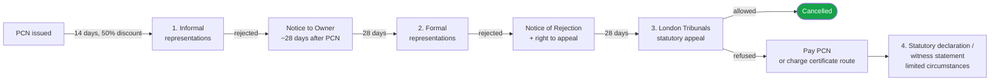

# Representations & appeals — the stages

The PCN appeal process in London has four stages. Most appeals are won at stage 1 or stage 2. Stage 3 is the formal statutory appeal. Stage 4 is a refusal-to-pay route used only by enforcement-charge disputes.

## Stage 1 — Informal representations (within 14 days)

**When**: After the PCN is issued and before the 14-day discount window closes.

**Where**: Council's online portal or correspondence address (email or post). Each council differs — Snappeal's knowledge base routes you to the right channel.

**Who decides**: A council parking-services officer at their discretion. They can cancel on mitigating circumstances alone (medical emergency, loading, Blue Badge, etc.), without you needing to cite a statutory ground.

**Outcome timeline**: Typically 2–4 weeks. The discount window is **paused** while the council considers your informal representation (you do not lose the 50% discount by appealing — but check the council's wording).

**Most-likely outcomes**:
- **Cancelled** — PCN withdrawn entirely.
- **Rejected** — proceed to stage 2 once the council issues a Notice to Owner.

**Snappeal's role**: drafts the informal representation letter, identifies the right ground given your evidence, addresses it to the correct council channel.

## Stage 2 — Formal representations (within 28 days of Notice to Owner)

**When**: After the council issues a **Notice to Owner** (NtO) — usually 28 days after the PCN was issued, if you haven't paid or successfully appealed informally.

**Where**: Same council, but the formal channel — usually a different form on the same portal.

**Who decides**: A council adjudication team, applying the **six statutory grounds** in [TMA 2004](tma-2004.md).

**Outcome timeline**: The council has **56 days** to respond to a formal representation. They must either cancel the PCN or issue a **Notice of Rejection**.

**Discount status**: The discount window is permanently closed by this stage. The full PCN amount (Band A £160 / Band B £130 in 2025, per [London Councils](https://www.londoncouncils.gov.uk/news-and-press-releases/2025/london-boroughs-raise-parking-and-traffic-pcn-levels-first-time-2011-0)) applies.

**Most-likely outcomes**:
- **Cancelled** — PCN withdrawn.
- **Rejected, with right to appeal** — Notice of Rejection issued. You have 28 days to escalate to the Tribunal.
- **Reduced charge offer** — some councils offer to reinstate the 50% discount if you pay within 14 days of the Notice of Rejection. Reading this offer carefully is important.

**Snappeal's role**: drafts the formal representation citing the appropriate statutory ground from TMA 2004 Schedule 1.

## Stage 3 — London Tribunals (within 28 days of Notice of Rejection)

**When**: After a formal representation is rejected.

**Where**: [London Tribunals](https://www.londontribunals.gov.uk/) — the independent adjudicator for London PCNs (formerly PATAS). The motorist files an appeal online, by post, or in person.

**Who decides**: A statutory **adjudicator** (independent of the council). The adjudicator considers the same six statutory grounds plus general fairness.

**Outcome timeline**: 4–10 weeks typically. The hearing is on the papers by default; the motorist can request an oral hearing.

**Outcome**: The adjudicator's decision is **legally binding**. Cancelled = PCN gone, council can't pursue further. Refused = the motorist must pay the PCN (often with a charge certificate adding 50% to the original).

**London Tribunals statistics (2024-25)**:
- Total appeals: **47,935** (up 13.6% YoY).
- Allowed (motorist wins): **49.4%**.

Source: [London Councils, *Enforcement and appeals statistics 2024-25*](https://www.londoncouncils.gov.uk/news-and-press-releases/2025/london-councils-enforcement-and-appeals-statistics-2024-25).

**Snappeal's role (v0.1)**: drafts the Tribunal appeal letter. We do not represent at oral hearings — for that, see London Tribunals' self-representation guidance.

## Stage 4 — Statutory declaration / witness statement (limited)

Only relevant if the motorist did **not** receive any of the prior notices (e.g., genuinely moved house and the council still sent correspondence to the DVLA address). The motorist can apply to **revoke the order for recovery** at the Traffic Enforcement Centre at Northampton County Court via a statutory declaration. Out of scope for Snappeal v0.1 — we direct affected users to the [TEC guidance](https://www.gov.uk/parking-tickets/challenge-a-parking-ticket).

## Critical dates summary

| Deadline | Counted from |
|---|---|
| 14 days for 50% discount | PCN issue date |
| 28 days to respond to Notice to Owner (formal rep) | NtO issue date |
| 28 days to appeal to Tribunal | Notice of Rejection date |

Miss any of these and you escalate to the next stage automatically — usually at higher cost. **Snappeal's home screen tracks these dates per appeal and shows the days remaining**, so users don't accidentally lose the discount or the right to appeal.
