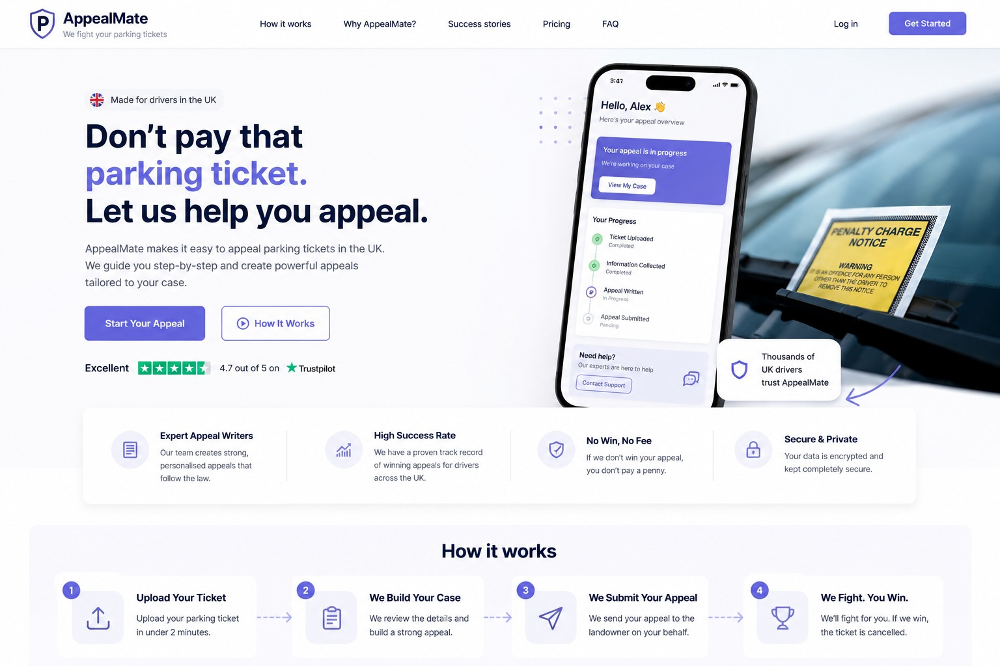
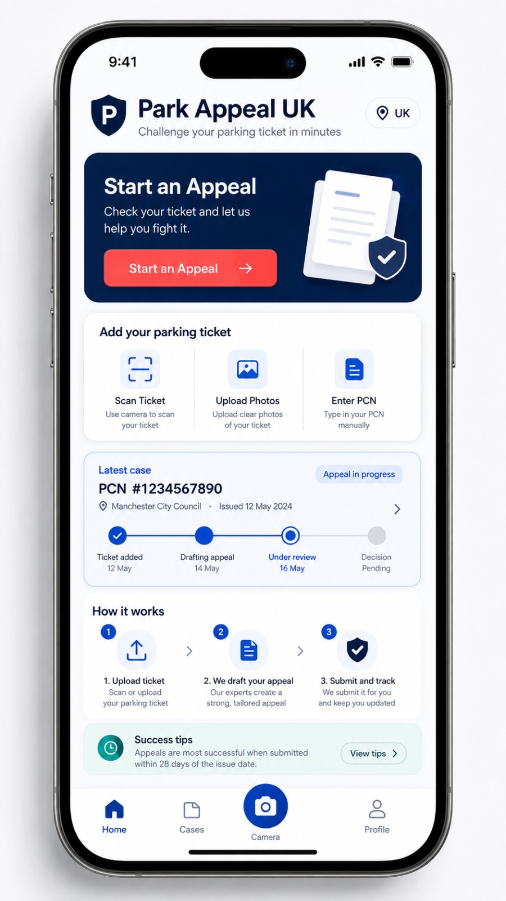

# Mockups

Visual references for the Snappeal brand and app. The first mockup is the app's in-product home screen; the second is the public marketing homepage. Both share a shield logo, navy/purple brand language, and a four-step "Your Progress" timeline.

---

## 1. Marketing homepage (received 2026-05-19, evening)

The public-facing **homepage** at `snappeal.ai` (or chosen domain). What a first-time visitor sees before they sign in or download.

<figure markdown>
  { width="720" }
  <figcaption>Snappeal — public marketing homepage, v0.1 mockup.</figcaption>
</figure>

### Anatomy of the page

| Region | Element | Copy / detail |
|---|---|---|
| Top nav (left) | Shield-P logo + wordmark **Snappeal** + tagline *"We fight your parking tickets"* | Identity block. |
| Top nav (centre) | How it works · Why Snappeal? · Success stories · Pricing · FAQ | Five primary nav items. |
| Top nav (right) | **Log in** (text) + **Get Started** (filled purple button) | Two-step CTA hierarchy. |
| Hero pill | 🇬🇧 *"Made for drivers in the UK"* | UK-wide framing. |
| Hero headline | *"Don't pay that **parking ticket** [purple]. Let us help you appeal."* | Two-line, mixed weights, purple highlight on key noun. |
| Hero body | *"Snappeal makes it easy to appeal parking tickets in the UK. We guide you step-by-step and create powerful appeals tailored to your case."* | One paragraph. |
| Hero CTAs | **Start Your Appeal** (filled purple) + **How It Works** (outlined with ▶ icon) | Primary + play-secondary. |
| Trustpilot | *"Excellent · 4.7 out of 5 on Trustpilot"* with green-star block | Trust signal — see audit note. |
| Hero visual | Phone mockup overlaid on a real PCN-on-windscreen photo; phone shows "Hello, Alex 👋", an "appeal in progress" purple card, a 4-step progress timeline, and "Need help?" support card. Floating shield badge: *"Thousands of UK drivers trust Snappeal"*. | Mirrors the in-app home screen (mockup #2 below). |
| Trust strip | 4 features in a horizontal card: **Expert Appeal Writers** · **High Success Rate** · **No Win, No Fee** · **Secure & Private** | Risk-relevant copy — see audit. |
| How it works | 4 numbered steps with icons: **1. Upload Your Ticket** · **2. We Build Your Case** · **3. We Submit Your Appeal** · **4. We Fight. You Win.** | Sub-copy: *"Upload your parking ticket in under 2 minutes"*, *"We review the details and build a strong appeal"*, *"We send your appeal to the **landowner** on your behalf"*, *"We'll fight for you. If we win, the ticket is cancelled."* |

### Visual style

- **Primary**: purple/violet (≈ `#6c5ce7` — exact swatch TBC from designer)
- **Secondary**: navy (logo, body text)
- **Backgrounds**: very light grey (`~#f6f7fb`) panels, white cards
- **Status accents**: green (completed), purple (in progress), grey (pending)
- **Typography**: heavy headlines (extra bold), regular body, navy on light
- **Logo**: navy shield containing a white **P**

---

## 2. In-app home screen (received 2026-05-19, morning)

<figure markdown>
  { width="320" }
  <figcaption>Snappeal — in-app home screen, v0.1 mockup.</figcaption>
</figure>

### Anatomy of the screen

| Region | Element | Notes |
|---|---|---|
| Top bar | Shield-P logo · "Park Appeal UK" (legacy long-form, now superseded by Snappeal) · "Challenge your parking ticket in minutes" · `UK` location pill | The `UK` pill reads `London` for the locked v0.1 scope. |
| Hero card | Navy panel, white headline "Start an Appeal", supportive copy, **red→now purple** primary CTA, document+shield illustration | Brand colour now aligned with homepage mockup (purple, not red). |
| Capture row | Three options: **Scan Ticket** · **Upload Photos** · **Enter PCN** (manual) | Three entry paths, not just photo. |
| Latest case | PCN ref · council name (*Manchester* in the mockup — reads as London council for the locked scope) · issue date · status pill *"Appeal in progress"* · 4-step progress timeline | Status tracking is first-class. |
| How it works | 3 steps: *Upload ticket* → *We draft your appeal* → *Submit and track* | "We" framing matches homepage mockup. |
| Success tips | Green admonition: *"Appeals are most successful when submitted within 28 days of the issue date"* + **View tips** button | Tips library is a real surface. |
| Bottom nav | Home · Cases · **Camera (centred, accent)** · Profile | Four tabs. Profile = Settings/Help/Privacy in v0.1 (no accounts). |

The [audit page](v0-1-mockup-audit.md) lists conflicts between both mockups and the wiki's locked decisions.
