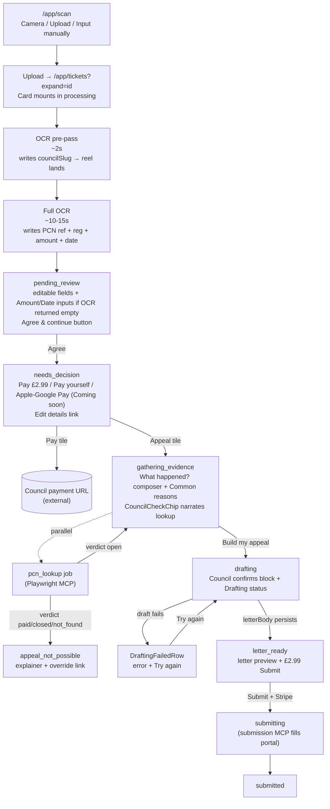

# User flow

Last refreshed **2026-05-27 (v0.3.10)**.

**Launch shape (v0.3.10)**: Scan → Confirm (Agree, validate-first) → Pay or Appeal. The Agree tap is what fires the council lookup — no Claude tokens are spent before that. Picking Appeal kicks off the Build-appeal quiz while the lookup either continues or has already settled. Drafting waits for both, then the £2.99 Submit lands. The whole flow lives on ONE smart card on `/app/tickets`. No detail page, no separate paywall page, no full-page blockers.

## End-to-end happy path

## Step-by-step

### 1. Scan

`/app/scan` is the dedicated scan landing page. Three buttons:
- **Camera** — fires the hidden `<input type="file" capture="environment">` to launch the OS camera.
- **Upload picture** — fires the library picker.
- **Input manually** — `/app/manual-entry` no-photo path.

Camera + Upload both feed `uploadPcn(dataUrl)`. On success the user routes to `/app/tickets?expand=<appealId>`. The list page auto-expands the new card.

### 2. OCR (two passes, v0.3.10 combined extract+coach)

`/api/extract` runs TWO sequential Claude calls inside one request:

1. **`identifyCouncil()`** — ~2 s. Returns only `{issuer, councilSlug}`. The endpoint PATCHes the partial ticket onto the appeal row mid-request.
2. **`extractTicket()`** — ~10–15 s. Returns `{ ticket, confidence, coach, modelUsed, costUsd }` — full ticket fields + the inline photo-coach `{quality, advice}` block in a single Claude vision call. v0.3.10 consolidated the previously-separate `coachPhoto()` call here to halve per-upload Claude cost (~$0.13 → ~$0.075). The `coach` block is wrapped in `.catch({...}).default({...})` so a malformed coach key never fails OCR. PATCHes the complete ticket on top.

The smart card's poll picks up the partial mid-request. The `IssuerLogoReel`'s `scanning` prop flips false the moment `appeal.councilSlug` is set, so the reel locks on the right council early. Card kind stays `processing` until both passes complete.

After the second PATCH, `mergeDuplicateDraftIfAny` runs in a transaction: a second upload of the same `(pcnRef, vehicleReg)` collapses onto the older draft, with explicit FK sweeps across `jobs` (no FK), `payments` (no cascade), and `notification_dispatches` (SET NULL). Bad-quality photos surface an amber "Photo looks rough — try X" pill inside the pending-review body.

### 3. Pending review (the Agree gate, v0.3.6+)

Card transitions to `pending_review`. The body renders:

- **Editable rows** for PCN ref + Vehicle reg (always shown). Council picker on the header tile.
- **Conditional Amount input** (£-prefixed, in pounds) — only when OCR returned `amountPence === 0`. Disabled until filled.
- **Conditional Issue Date input** (native `<input type="date">`) — only when OCR returned `issuedAt === ""`. Disabled until filled.
- **Photo coach amber pill** (only when `coach.quality !== "good"`).
- **Agree & continue** button — disabled until PCN ref + reg + council + (conditional Amount + Date) are all filled.

Tapping Agree PATCHes `step=ticket_confirmed`. Pure UX gate — no AI work, no lookup, no cost. Card flips to `needs_decision`.

### 4. Pay or Appeal (validate-first, single trigger, v0.3.10)

The lookup ran (or is running) from the Agree tap in step 3 — `agreeTicket` is the single trigger; `useAutoValidate` is the backstop. Both helpers send `x-parkingrabbit-session` so guest customers' lookup POSTs don't 403. `enqueueLookupIfAutomated` has two layers of idempotency (queued/running siblings + already-settled non-error verdicts) to fix the "lookup fires twice" bug. When the worker writes the verdict, the card's status-snapshot `useEffect` (deps now include `portalLookup?.status`) bridges `validating` → `needs_decision` with no manual refresh.

`needs_decision` renders `<PayAppealTiles>` (three tiles via `<ReviewRecommendation>`):

1. **Appeal £2.99** (primary). Tap → `startAppeal()` PATCHes `preferredMethod=portal` and flips the card to `gathering_evidence`. No lookup POST here — the lookup already fired in step 3.
2. **Pay yourself** (free). External `<a href>` to the council's payment URL, opens in a new tab. No draft. Zero AI cost.
3. **Apple/Google Pay** ("Coming soon"). Inert placeholder.

Plus an "Edit details" link that PATCHes `step` back to the default so the user can pop back to the confirm view.

### 5. Build appeal (the conversation surface)

`gathering_evidence` body:

- **`<CouncilCheckChip>`** at the top — narrates the lookup state. While `pending` it streams the live MCP agent thought (e.g. *"Now clicking through each enforcement photograph"*). Once the lookup verifies it becomes a green pill (or a green CARD listing each field the council overrode, with old → new diffs).
- **"What happened?" composer** — one large textarea, mic + photo-attach buttons. Dictation appends to the textarea.
- **Common reasons** pills (12 reasons, clamped to 3 visible rows by default with "Show all" expand). Each pill maps to one or more `CanonicalGroundId`s in the 75-card grounds catalog.
- **"Build my appeal"** CTA — enabled when at least one reason is picked OR the composer has text.

Tapping Build my appeal PATCHes `step=evidence_gathered` (`EVIDENCE_DONE_STEP`) + grounds + notes in one atomic write. Card flips to `drafting`.

### 6. Drafting (with the council-confirms block)

`drafting` body stacks TWO surfaces:

- **`<CouncilConfirmedDetails>`** — structured listing of every populated field from `portalLookup.metadata` (PCN Ref, Vehicle Reg, Contravention Code, Location, Issued At, Amount, Discount Until, Full Charge From). Lets the user read exactly what the AI is drafting against. Hidden until lookup is verified.
- **Status row** — three micro-states:
  - **Waiting on lookup** — when `step === EVIDENCE_DONE_STEP` but `portalLookup.status === "pending"`. Copy: *"Rabbit is finishing the council check before drafting your appeal — usually a few more seconds."*
  - **Drafting** — Claude is streaming. The route chunks the letter at 80 chars / 30 ms for the typing animation.
  - **Failed** — `DraftingFailedRow` shows the captured error message (`processing.draft.error`) + a **Try again** button. The Retry handler PATCHes `step=EVIDENCE_DONE_STEP` to re-fire the draft kickoff effect.

The draft kickoff is gated by a separate `useEffect` in `TicketCard.tsx`: fires `/api/generate-stream` only when BOTH `step === EVIDENCE_DONE_STEP` AND `lookup-settled` AND `verdict-not-bad`. Server-side, the route has an in-flight guard via `processing.draft.status === "running"` to prevent double-firing from a back-nav / refresh / route swap during the drafting window.

### 7. Letter ready

`letter_ready` body shows the full rendered letter + strength badge + £2.99 Submit CTA (`<PaidSubmitCta>`).

Strength badges:
- **≥ 80** → green "Strong appeal" pill.
- **50–79** → amber "Solid appeal" pill.
- **< 50** → red `<aside>` above the Submit button with the AI's rationale + up to 3 evidence-improvement asks. CTA label flips to "Submit anyway for £2.99". User can attach more evidence and `rescoreWithEvidence` re-runs `scoreAppealStrength()` in place (no letter redraft).

### 8. Submit

Tap £2.99 → `<PaymentSheet>` mounts (Stripe `<PaymentElement>` with Apple Pay / Google Pay / Card detection, or `<FakePaymentButtons>` when `NEXT_PUBLIC_PARKINGRABBIT_FAKE_PAYMENT=1`). On success the PaymentIntent id is forwarded to `/api/submit`, which enqueues a `submit_appeal` job. The card flips to `submitting`.

The submission MCP fills the council's Make-Representation form (or sends an email for non-automated councils), captures a confirmation screenshot, writes a `submissions` row, and flips `appeal.status` to `submitted`. Live agent screenshots stream via SSE through `<MCPLiveStrip>` — only visible during `submit_appeal` (the `pcn_lookup` audit screenshots persist server-side but never render in the customer UI).

### 9. Submitted

`submitted` body shows a green confirmation, the council reference, and a "We'll notify you when the council replies" message. Inbound mail handling parses council replies and bumps the appeal to `under_review` / `decision_pending` / `cancelled` / `rejected`.

## Failure states

Any of these can replace the happy-path body without leaving the smart card:

- **`appeal_not_possible`** — lookup verdict is paid/closed/not_found. Body shows the verdict + a Pay-yourself link + "I disagree — let me appeal anyway" override.
- **`council_lookup_failed`** — `portal.status === "error"` (CAPTCHA, portal down, timeout). Body offers Retry / Continue anyway / Edit details.
- **`extraction_failed` / `image_issue` / `image_unclear` / `info_needed`** — four OCR-failure CardKinds with recovery actions (retake photo / edit fields manually).
- **`drafting + step=generation_failed`** — Claude CLI errored. Body's `<DraftingFailedRow>` surfaces the captured error message + a Retry button.

## Background notifications

`<NotificationWatcher>` (mounted in `app/app/layout.tsx`) polls `/api/appeals` every 5 s in the foreground / 30 s when the tab is hidden. Three notification kinds — `validation`, `draft`, `submit` — fire native browser notifications + bump the in-app bell's unread counter when the appeal row flips state. Permission prompt fires at the moment of value (e.g. right after Appeal tap), not on app launch.

## Where this lives in code

- `apps/web/app/app/scan/page.tsx` — the scan landing page.
- `apps/web/app/app/tickets/page.tsx` — the list + smart card host.
- `apps/web/components/TicketCard.tsx` — handler logic + state-derive consumer (modularised in v0.3.10 into `components/ticket/{StatusPill,DeleteTicketButton,Field,FailureActions,SubmissionStatusBits}.tsx`).
- `apps/web/components/TicketCardBody.tsx` — per-state body rendering.
- `apps/web/app/app/manual-entry/page.tsx` — single-page manual entry; `?appealId=<id>` prefills from OCR partial reads.
- `apps/web/components/PayAppealTiles.tsx` + `apps/web/components/ReviewRecommendation.tsx` — the tile surface.
- `apps/web/components/TicketLifecycleTimeline.tsx` — the rail.
- `apps/web/lib/deriveCardState.ts` — the state machine.
- `apps/web/lib/client/uploadPcn.ts` — the upload helper.
- `apps/web/app/api/extract/route.ts` — OCR endpoint.
- `apps/web/app/api/generate-stream/route.ts` — drafting SSE.
- `apps/web/app/api/submit/route.ts` — paid submission entry.
