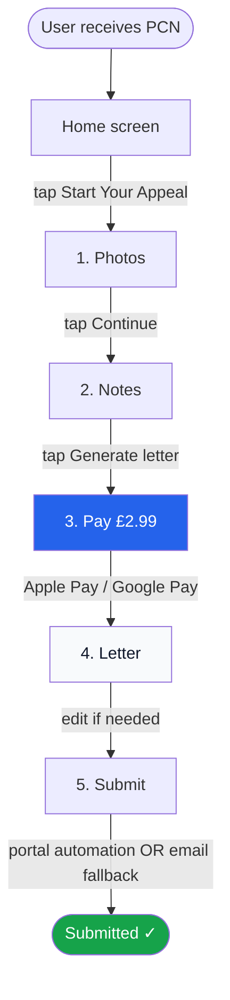

# User flow

The full appeal journey is five steps. Every step is a single screen with at most one decision.

## Step 1 — Photos

**Screen prompt:** "Take a photo of your PCN, then a few of the car and the scene."

- **Required:** one photo of the PCN itself.
- **Optional but encouraged:** up to 6 photos of the car in situ, the signs, the road markings, the suspension notice, the bay paint, the surrounding context. The more honest evidence the AI has, the better the letter.
- **Camera or upload.** Single tap to open the camera; second button for the photo library.
- **No cropping, no enhancement.** We process the raw image.

**Acceptance criteria:**
- "Continue" stays disabled until the PCN photo is present.
- Image preview shown for every photo; long-press to remove.
- Photos persist if the user closes the app and returns.

## Step 2 — Notes

**Screen prompt:** "In a sentence or two, what happened?"

- Single textarea.
- Optional placeholder text rotates through honest examples ("I was loading the van", "the signs were behind a parked truck", "I had a Blue Badge but the clock was wrong").
- No structured form. We deliberately resist asking the user to pick a ground — the AI does that from photos + notes.

**Acceptance criteria:**
- Notes step can be skipped (empty notes still produce a letter from photos alone).
- 800-character soft limit (longer is allowed; we trim diplomatically in the letter).

## Step 3 — Pay

**Screen prompt:** "ParkingRabbit this PCN for £2.99."

- Stripe Payment Element.
- Apple Pay button on iOS Safari; Google Pay button on Android Chrome; card form as fallback.
- One paragraph above the button states the offer clearly: *"£2.99 to appeal this PCN. Non-refundable — you're paying for the appeal we draft and submit, not for the outcome."*

**Acceptance criteria:**
- No generation runs server-side until the webhook confirms payment.
- Failed payment returns the user to the notes screen with the photos and notes intact.
- Successful payment unlocks letter generation and starts the AI call immediately.

## Step 4 — Letter

**Screen prompt:** "Your appeal letter."

- The letter streams in (visible token-by-token) so the user sees progress.
- Above the letter: the extracted ticket fields in a collapsible card — issuer, PCN ref, vehicle reg, contravention code, date, location, amount.
- Below the letter: three actions — **Copy**, **Share**, **Submit**.
- The letter body is **directly editable** — tap any line, edit in place. Edits persist.

**Acceptance criteria:**
- Letter is addressed correctly (council name, postal address from KB).
- The cited contravention code matches the extracted code.
- The cited statutory ground is one of the six TMA-2004 grounds or a recognised informal ground (signage, loading, blue-badge, breakdown, medical).
- Letter length is 250–500 words. No padding.

## Step 5 — Submit

**Behaviour:**
- **Submit** is the primary action. The user pays £2.99 *for* the submission — the app delivers it. The engine picks the best available channel:
  - **Portal automation** (preferred) — an LLM agent in a Vercel Sandbox uses Playwright MCP to fill the council's online form, upload the PCN and evidence photos, and capture the confirmation reference.
  - **Email fallback** — when the portal is congested, unsupported, or down, the appeal is sent as a structured email from a per-user transactional alias, with photos attached.
- The user sees a single result: **"Submitted ✓"** — plus the channel used and the council reference (or message-id for email).
- **Copy** and **Share** remain as secondary actions for users who want to keep a personal record of the letter.

Full engine design in [architecture/submission-engine.md](../architecture/submission-engine.md).

**Acceptance criteria:**
- Submit is the primary action; Copy and Share are secondary.
- Status pill updates: `draft` → `ready` → `submitting` → `submitted` (with channel shown).
- If portal automation fails, the channel switch to email is invisible to the user — they see one "Submitted ✓" outcome regardless of path.

## Friction budget

Total taps from app launch to "appeal sent" — target ceiling:

| Step | Taps |
|---|---|
| Home → Start Your Appeal | 1 |
| Photos (PCN + 2 evidence) | 3 |
| Photos → Continue | 1 |
| Notes (typing not counted) | 0 |
| Notes → Generate letter | 1 |
| Pay sheet → Apple Pay confirm | 1 |
| Letter → Submit | 1 |
| Portal opens; user pastes/submits | 1 |
| **Total** | **9 taps** |

The marketing claim is "five-tap appeal". The two numbers differ because the marketing claim excludes the photo captures (counted as a single capture event in the user's head) and the portal-side submit (counted as council-side, not ParkingRabbit-side). Both reductions are defensible.
